# Lecture 2: Regularization and Optimization

## Course Overview

This lecture provides an in-depth exploration of two core concepts in deep learning and computer vision: **Regularization** and **Optimization**. The course begins with a review of image classification tasks and the fundamentals of linear classifiers, then delves into how to evaluate model performance using loss functions, how to prevent overfitting through regularization, and how to train models using various optimization algorithms (especially gradient descent and its variants).

## Table of Contents

1. [Review: Image Classification and Linear Classifiers](#1-review-image-classification-and-linear-classifiers)
2. [Loss Functions](#2-loss-functions)
3. [Regularization](#3-regularization)
4. [Optimization](#4-optimization)
5. [Gradient Descent and Its Variants](#5-gradient-descent-and-its-variants)
6. [Learning Rate Scheduling](#6-learning-rate-scheduling)
7. [Summary and Outlook](#7-summary-and-outlook)

---

## 1. Review: Image Classification and Linear Classifiers

### 1.1 Image Classification Task

**Image Classification** is one of the core tasks in computer vision, with the goal of mapping input images to a predefined set of category labels.

**Task Definition**:

- **Input**: Image (multidimensional array of pixel values)
- **Output**: Category label (e.g., cat, dog, bird, deer, truck)

### 1.2 Challenges in Image Classification

1. **Semantic Gap**
   - Human perception: sees "cat"
   - Computer representation: numerical grid of pixel values

2. **Image Variations**
   - **Illumination Changes**: pixel intensities vary under different lighting conditions
   - **Occlusion**: objects are partially blocked
   - **Deformation**: objects can bend and twist
   - **Background Clutter**: objects blend with the background
   - **Intra-class Variation**: different instances of the same category vary greatly in appearance

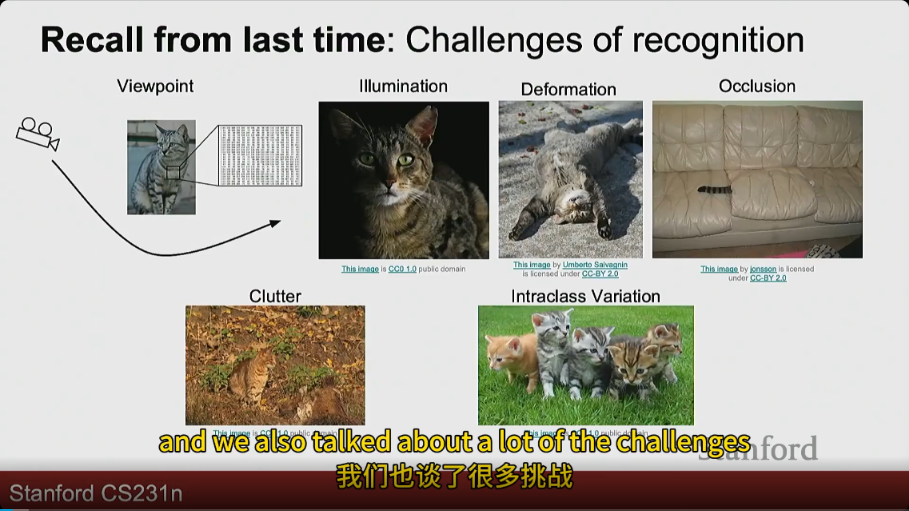
[00:00:56](https://www.bilibili.com/video/BV1YJ3PzLEiW/?p=3&spm_id_from=333.1007.top_right_bar_window_history.content.click&vd_source=2c95328d728d9b9a500883028f75d2f3)

### 1.3 K-Nearest Neighbors Classifier

**Basic Idea**: For a new data point, find the K nearest samples in the training set and use majority voting to determine the category.

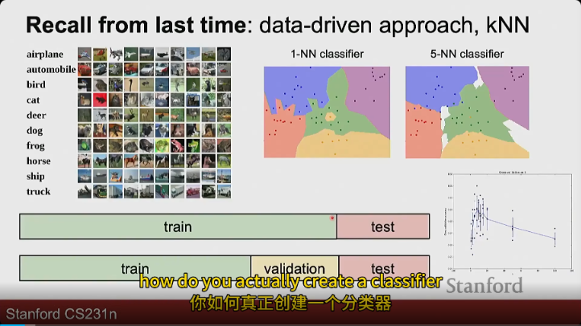
[00:02:55](https://www.bilibili.com/video/BV1YJ3PzLEiW/?p=3&spm_id_from=333.1007.top_right_bar_window_history.content.click&vd_source=2c95328d728d9b9a500883028f75d2f3)

**Distance Metrics**:

1. **L1 Distance (Manhattan Distance)**:
   $$d_{L1}(\mathbf{x}, \mathbf{y}) = \sum_{i=1}^{n} |x_i - y_i|$$

2. **L2 Distance (Euclidean Distance)**:
   $$d_{L2}(\mathbf{x}, \mathbf{y}) = \sqrt{\sum_{i=1}^{n} (x_i - y_i)^2}$$

**Hyperparameter Selection**:

- Use training set/validation set/test set split
- Select optimal K value on validation set
- Evaluate final performance on test set

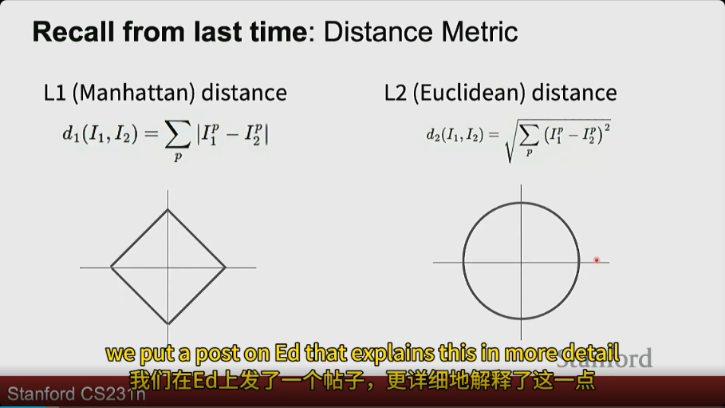
[00:04:22](https://www.bilibili.com/video/BV1YJ3PzLEiW/?p=3&spm_id_from=333.1007.top_right_bar_window_history.content.click&vd_source=2c95328d728d9b9a500883028f75d2f3)

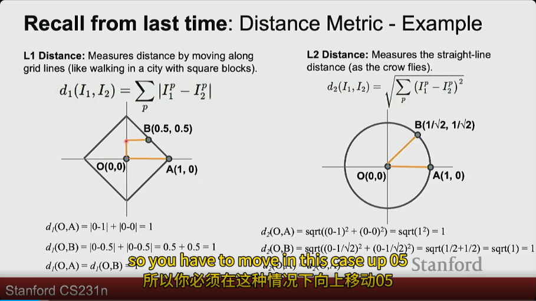
[00:05:05](https://www.bilibili.com/video/BV1YJ3PzLEiW/?p=3&spm_id_from=333.1007.top_right_bar_window_history.content.click&vd_source=2c95328d728d9b9a500883028f75d2f3)

### 1.4 Linear Classifier

**Model Formula**:
$$f(\mathbf{x}, \mathbf{W}) = \mathbf{W}\mathbf{x} + \mathbf{b}$$

Where:

- $\mathbf{x}$: Input image (flattened as vector, size $32 \times 32 \times 3 = 3072$)
- $\mathbf{W}$: Weight matrix (size $C \times D$, where C is number of classes, D is feature dimension)
- $\mathbf{b}$: Bias vector (size $C$)

**Three Interpretation Perspectives**:

1. **Algebraic Perspective**: Each row of weights performs dot product with input vector to obtain class score

2. **Template Perspective**: Each row of weights can be visualized as a "template" for that class

3. **Geometric Perspective**: Each row of weights defines a decision boundary (hyperplane) in feature space

**Limitations**: Linear classifiers can only learn linear decision boundaries and cannot handle non-linearly separable data

---

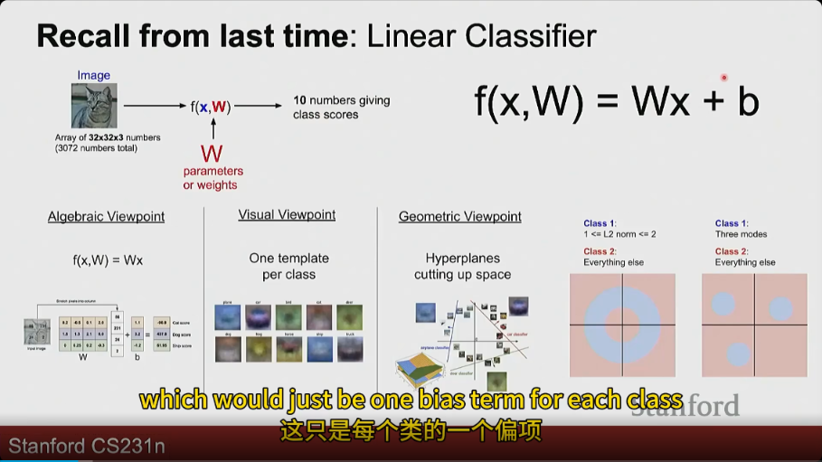
[00:06:31](https://www.bilibili.com/video/BV1YJ3PzLEiW/?p=3&spm_id_from=333.1007.top_right_bar_window_history.content.click&vd_source=2c95328d728d9b9a500883028f75d2f3)

## 2. Loss Functions

### 2.1 Definition of Loss Function

A **Loss Function** quantifies the discrepancy between model predictions and true labels.

**Mathematical Definition**:
$$L = \frac{1}{N} \sum_{i=1}^{N} L_i(f(\mathbf{x}_i, \mathbf{W}), y_i) + \lambda R(\mathbf{W})$$

Where:

- **Data Loss**: $\frac{1}{N} \sum_{i=1}^{N} L_i$ - measures how well the model fits the training data
- **Regularization Loss**: $\lambda R(\mathbf{W})$ - prevents overfitting
- $\lambda$: Regularization strength (hyperparameter)

### 2.2 Softmax Loss (Cross-Entropy Loss)

**Softmax Function**: Converts arbitrary real-valued vector into probability distribution
$$P(y_i = k | \mathbf{x}_i) = \frac{e^{s_k}}{\sum_{j} e^{s_j}}$$

**Cross-Entropy Loss**:
$$L_i = -\log P(y_i = y_{true} | \mathbf{x}_i) = -\log \left(\frac{e^{s_{y_{true}}}}{\sum_{j} e^{s_j}}\right)$$

**Properties**:

- When correct class probability is high, loss is low
- When correct class probability is low, loss is high
- Encourages model to output high-confidence correct predictions

---

## 3. Regularization

### 3.1 Motivation for Regularization

**Core Idea**: Perform slightly worse on training data but better on test data.

**Intuitive Example**:

- Model F1: Perfectly fits all training points (may overfit)
- Model F2: Simpler model with slightly higher training error but stronger generalization capability

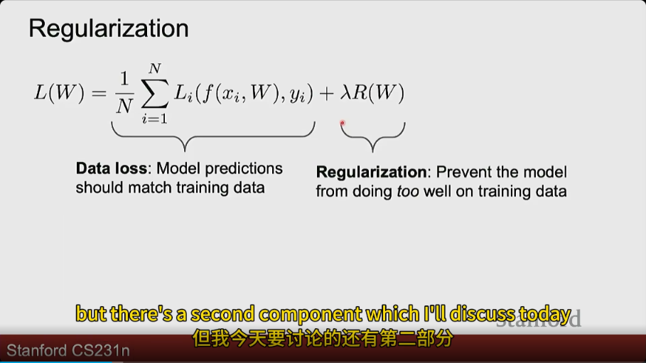
[00:11:54](https://www.bilibili.com/video/BV1YJ3PzLEiW/?p=3&spm_id_from=333.1007.top_right_bar_window_history.content.click&vd_source=2c95328d728d9b9a500883028f75d2f3)

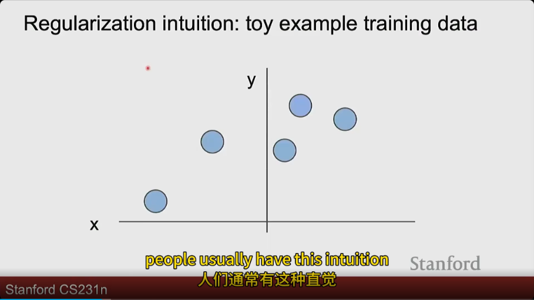
[00:13:04](https://www.bilibili.com/video/BV1YJ3PzLEiW/?p=3&spm_id_from=333.1007.top_right_bar_window_history.content.click&vd_source=2c95328d728d9b9a500883028f75d2f3)

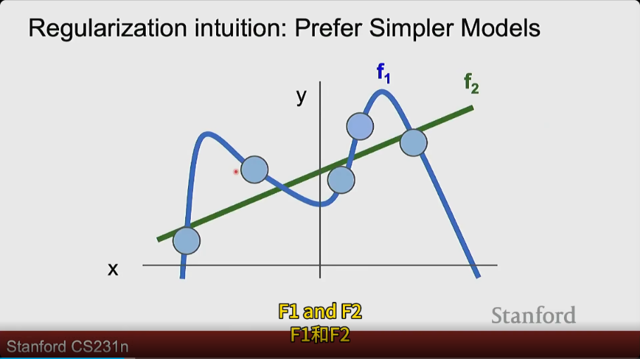
[00:13:18](https://www.bilibili.com/video/BV1YJ3PzLEiW/?p=3&spm_id_from=333.1007.top_right_bar_window_history.content.click&vd_source=2c95328d728d9b9a500883028f75d2f3)

**Occam's Razor Principle**: Among competing hypotheses, prefer the simplest one.

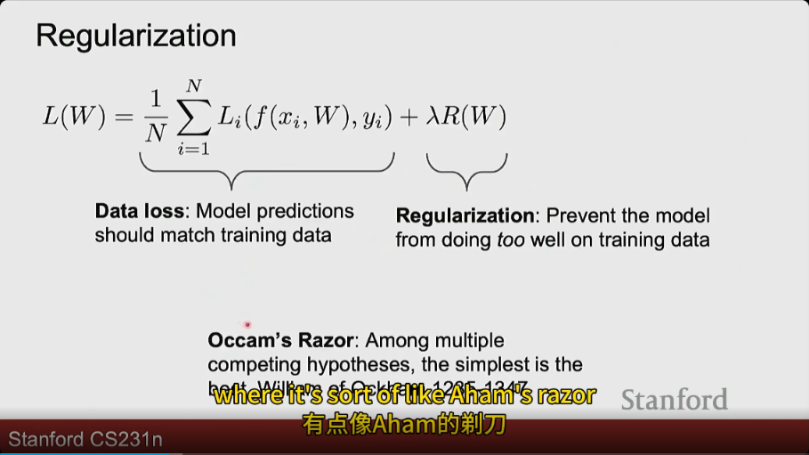
[00:14:19](https://www.bilibili.com/video/BV1YJ3PzLEiW/?p=3&spm_id_from=333.1007.top_right_bar_window_history.content.click&vd_source=2c95328d728d9b9a500883028f75d2f3)

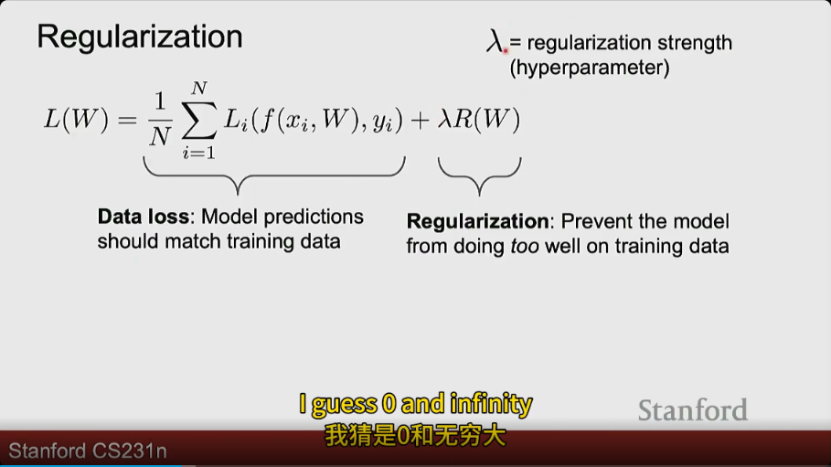
[00:14:59](https://www.bilibili.com/video/BV1YJ3PzLEiW/?p=3&spm_id_from=333.1007.top_right_bar_window_history.content.click&vd_source=2c95328d728d9b9a500883028f75d2f3)

### 3.2 L2 Regularization (Weight Decay)

**Definition**:
$$R(\mathbf{W}) = \sum_{i,j} W_{i,j}^2$$

**Properties**:

- Penalizes large weight values
- Prefers **distributed** weight distributions
- Due to squaring operation, smaller weights receive less penalty
- Leads to generally small but non-zero weight values

**Gradient**:
$$\frac{\partial R}{\partial W_{i,j}} = 2W_{i,j}$$

### 3.3 L1 Regularization

**Definition**:
$$R(\mathbf{W}) = \sum_{i,j} |W_{i,j}|$$

**Properties**:

- Prefers **sparse** weight distributions
- Leads to many weights being exactly zero
- Can be used for feature selection

**Gradient**:
$$\frac{\partial R}{\partial W_{i,j}} = \text{sign}(W_{i,j})$$

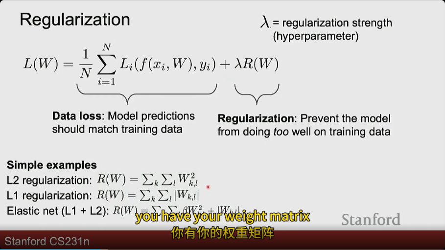
[00:15:29](https://www.bilibili.com/video/BV1YJ3PzLEiW/?p=3&spm_id_from=333.1007.top_right_bar_window_history.content.click&vd_source=2c95328d728d9b9a500883028f75d2f3)

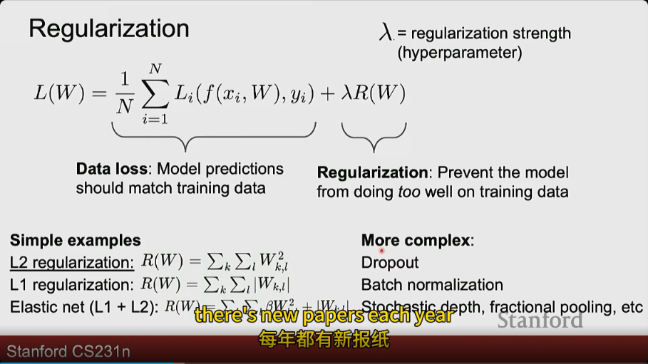
[00:18:21](https://www.bilibili.com/video/BV1YJ3PzLEiW/?p=3&spm_id_from=333.1007.top_right_bar_window_history.content.click&vd_source=2c95328d728d9b9a500883028f75d2f3)


[00:18:31](https://www.bilibili.com/video/BV1YJ3PzLEiW/?p=3&spm_id_from=333.1007.top_right_bar_window_history.content.click&vd_source=2c95328d728d9b9a500883028f75d2f3)

### 3.4 L1 vs L2 Comparison Example

Consider two weight sets with the same score:

- $\mathbf{w}_1 = [1, 0, 0, 0]$
- $\mathbf{w}_2 = [0.25, 0.25, 0.25, 0.25]$

**L2 Regularization**:

- $R(\mathbf{w}_1) = 1^2 = 1$
- $R(\mathbf{w}_2) = 4 \times (0.25)^2 = 0.25$
- **L2 prefers** $\mathbf{w}_2$ (more distributed)

**L1 Regularization**:

- $R(\mathbf{w}_1) = 1$
- $R(\mathbf{w}_2) = 4 \times 0.25 = 1$
- Both are the same (but in practice L1 tends toward sparse solutions)

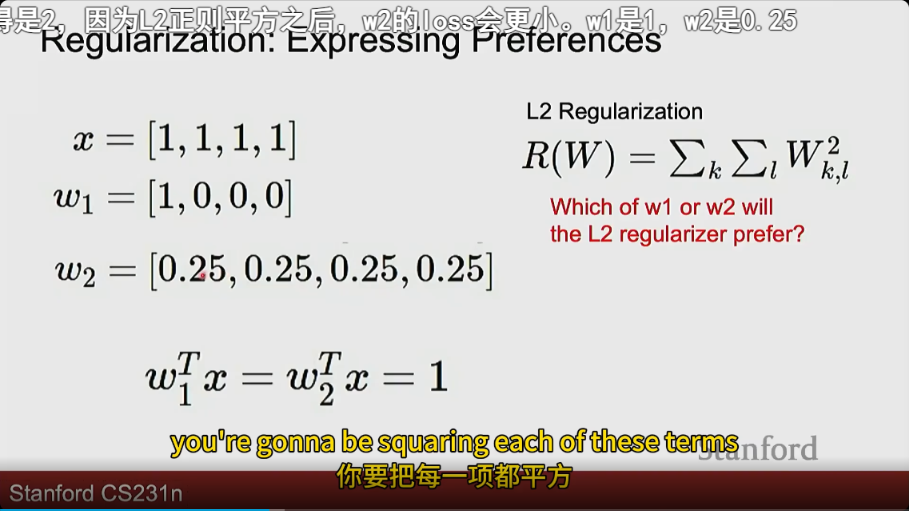
[00:20:20](https://www.bilibili.com/video/BV1YJ3PzLEiW/?p=3&spm_id_from=333.1007.top_right_bar_window_history.content.click&vd_source=2c95328d728d9b9a500883028f75d2f3)

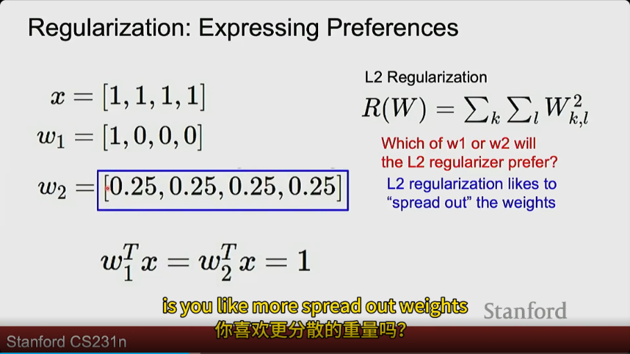
[00:20:37](https://www.bilibili.com/video/BV1YJ3PzLEiW/?p=3&spm_id_from=333.1007.top_right_bar_window_history.content.click&vd_source=2c95328d728d9b9a500883028f75d2f3)

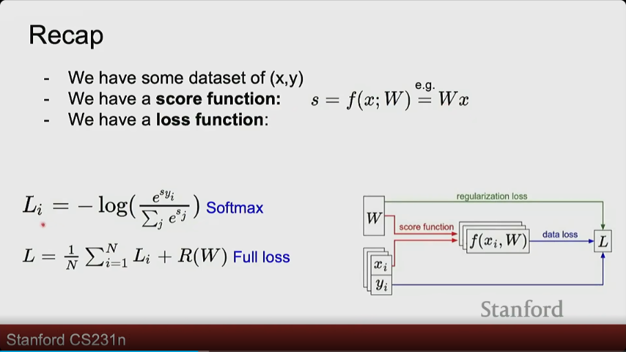
[00:21:43](https://www.bilibili.com/video/BV1YJ3PzLEiW/?p=3&spm_id_from=333.1007.top_right_bar_window_history.content.click&vd_source=2c95328d728d9b9a500883028f75d2f3)

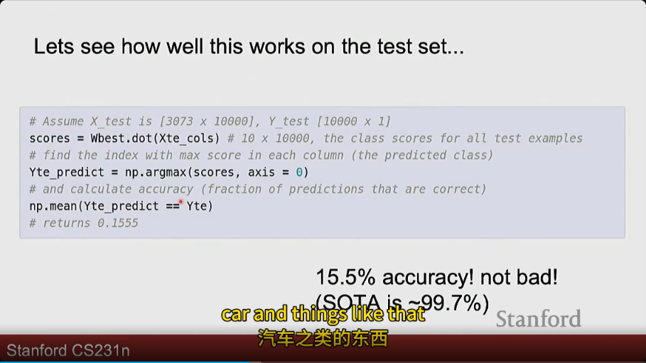
[00:26:32](https://www.bilibili.com/video/BV1YJ3PzLEiW/?p=3&spm_id_from=333.1007.top_right_bar_window_history.content.click&vd_source=2c95328d728d9b9a500883028f75d2f3)

### 3.5 Role of Regularization

1. **Express Model Preference**: Express preference for weights by choosing different regularization terms
2. **Improve Generalization**: Simplify model to prevent overfitting
3. **Improve Optimization**: The convexity of L2 regularization helps the optimization process

---

## 4. Optimization

### 4.1 The Optimization Problem

**Objective**: Find weights $\mathbf{W}^*$ that minimize the loss function
$$\mathbf{W}^* = \arg\min_{\mathbf{W}} L(\mathbf{W})$$

### 4.2 Loss Landscape

**Visualization Analogy**:

- **Vertical axis (Z-axis)**: Loss value
- **Horizontal axes (X, Y axes)**: Model parameters
- **Objective**: Find the lowest point in the landscape

**Key Limitation**:

- We are "blindfolded" - can only sense the local gradient at current position
- Cannot directly see the global optimum

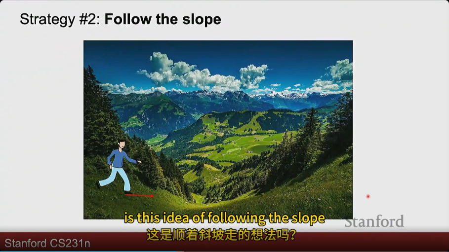
[00:26:54](https://www.bilibili.com/video/BV1YJ3PzLEiW/?p=3&spm_id_from=333.1007.top_right_bar_window_history.content.click&vd_source=2c95328d728d9b9a500883028f75d2f3)

### 4.3 Strategy 1: Random Search (Not Recommended)

```python
# Pseudocode
best_W = None
best_loss = float('inf')

for i in range(1000):
    W_random = np.random.randn(D, C)
    loss = compute_loss(W_random, X_train, y_train)
    if loss < best_loss:
        best_W = W_random
        best_loss = loss
```

**Performance**: Approximately 15.5% accuracy on CIFAR-10 (far below the optimal 99.7%)

### 4.4 Strategy 2: Follow the Slope (Gradient Descent)

**Core Idea**: Calculate the slope at current position and move in the downhill direction

## 5. Gradient Descent and Its Variants

### 5.1 Mathematical Definition of Gradient

**One-dimensional Derivative**:
$$\frac{df}{dx} = \lim_{h \to 0} \frac{f(x+h) - f(x)}{h}$$

**Multidimensional Gradient**:
$$\nabla_{\mathbf{W}} L = \left[\frac{\partial L}{\partial W_{1,1}}, \frac{\partial L}{\partial W_{1,2}}, \ldots, \frac{\partial L}{\partial W_{m,n}}\right]$$

**Important Properties**:

- Gradient direction is the direction of **steepest ascent**
- Negative gradient direction is the direction of **steepest descent**

### 5.2 Gradient Computation Methods

**Method 1: Numerical Gradient (Slow, Approximate)**

```python
def numerical_gradient(f, W, h=1e-5):
    grad = np.zeros_like(W)
    for i in range(W.shape[0]):
        for j in range(W.shape[1]):
            W[i,j] += h
            fpos = f(W)
            W[i,j] -= 2*h
            fneg = f(W)
            W[i,j] += h  # Restore
            grad[i,j] = (fpos - fneg) / (2*h)
    return grad
```

**Method 2: Analytical Gradient (Fast, Exact)**

- Derived using calculus chain rule
- Exact and efficient
- **Recommended for use, verify with numerical gradient**

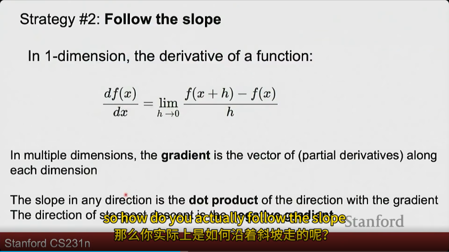
[00:27:33](https://www.bilibili.com/video/BV1YJ3PzLEiW/?p=3&spm_id_from=333.1007.top_right_bar_window_history.content.click&vd_source=2c95328d728d9b9a500883028f75d2f3)

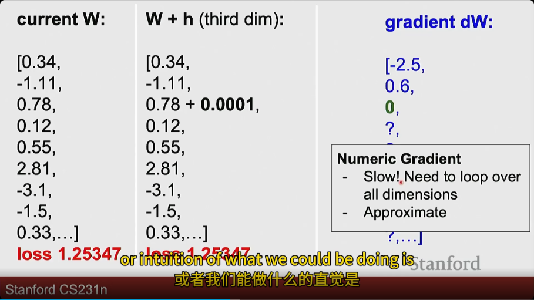
[00:29:35](https://www.bilibili.com/video/BV1YJ3PzLEiW/?p=3&spm_id_from=333.1007.top_right_bar_window_history.content.click&vd_source=2c95328d728d9b9a500883028f75d2f3)

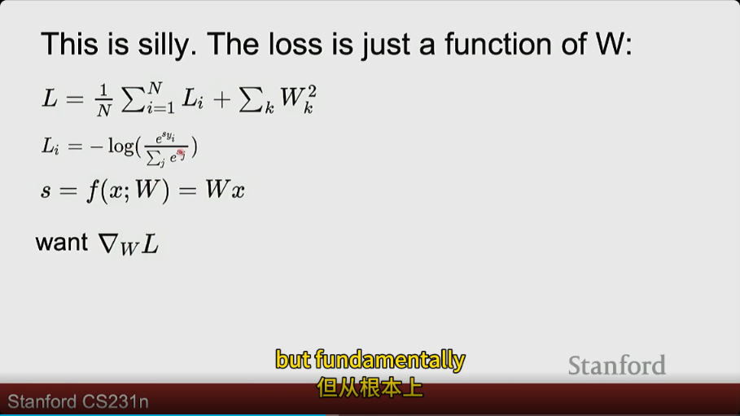
[00:30:11](https://www.bilibili.com/video/BV1YJ3PzLEiW/?p=3&spm_id_from=333.1007.top_right_bar_window_history.content.click&vd_source=2c95328d728d9b9a500883028f75d2f3)

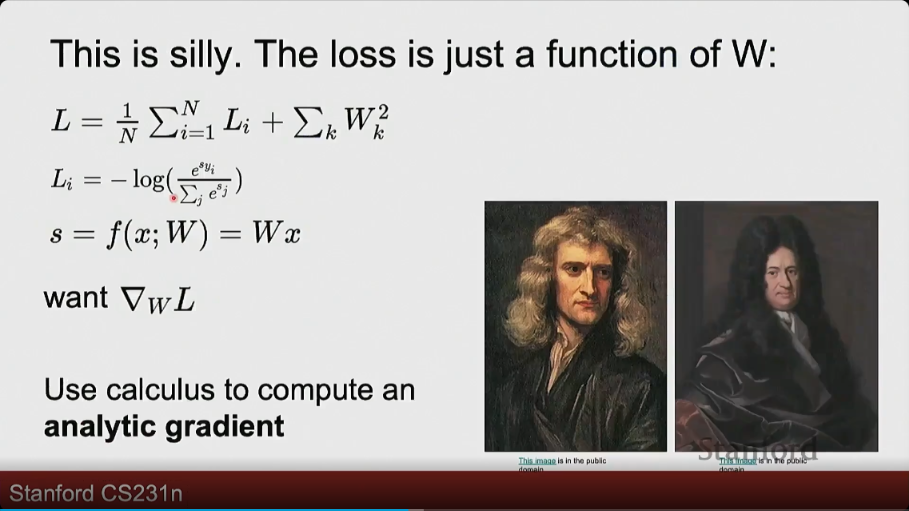
[00:30:50](https://www.bilibili.com/video/BV1YJ3PzLEiW/?p=3&spm_id_from=333.1007.top_right_bar_window_history.content.click&vd_source=2c95328d728d9b9a500883028f75d2f3)

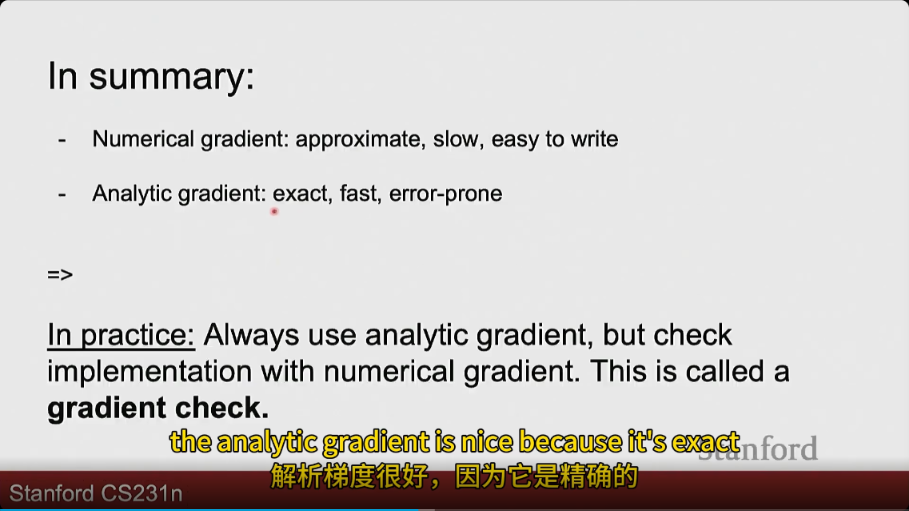
[00:31:35](https://www.bilibili.com/video/BV1YJ3PzLEiW/?p=3&spm_id_from=333.1007.top_right_bar_window_history.content.click&vd_source=2c95328d728d9b9a500883028f75d2f3)

### 5.3 Gradient Descent Algorithm

**Basic Algorithm**:

```python
# Pseudocode
while True:
    dW = compute_gradient(W, X, y)  # Compute gradient
    W = W - learning_rate * dW       # Parameter update
```

**Mathematical Form**:
$$\mathbf{W}_{t+1} = \mathbf{W}_t - \alpha \nabla_{\mathbf{W}} L(\mathbf{W}_t)$$

where $\alpha$ is the **learning rate (step size)**

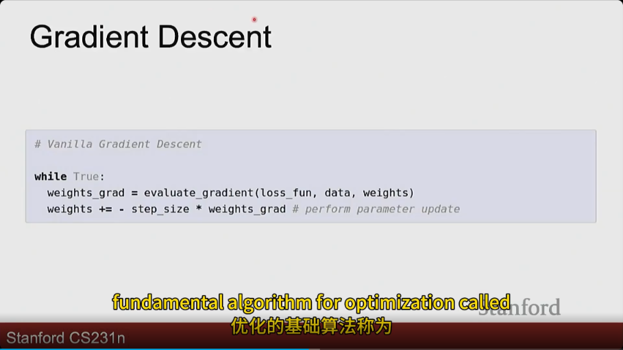
[00:34:01](https://www.bilibili.com/video/BV1YJ3PzLEiW/?p=3&spm_id_from=333.1007.top_right_bar_window_history.content.click&vd_source=2c95328d728d9b9a500883028f75d2f3)

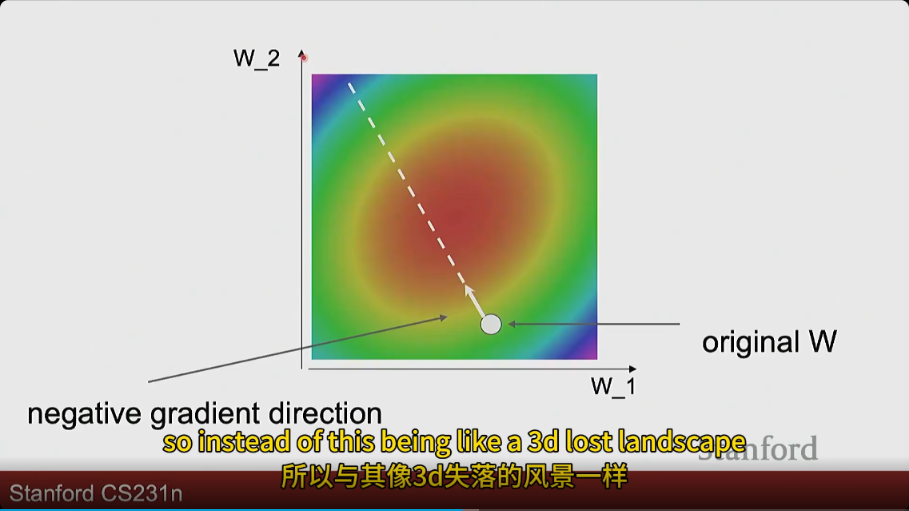
[00:34:55](https://www.bilibili.com/video/BV1YJ3PzLEiW/?p=3&spm_id_from=333.1007.top_right_bar_window_history.content.click&vd_source=2c95328d728d9b9a500883028f75d2f3)

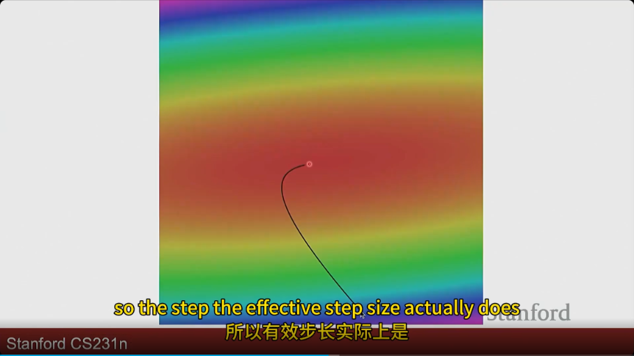
[00:35:34](https://www.bilibili.com/video/BV1YJ3PzLEiW/?p=3&spm_id_from=333.1007.top_right_bar_window_history.content.click&vd_source=2c95328d728d9b9a500883028f75d2f3)

### 5.4 Stochastic Gradient Descent (SGD)

**Motivation**: Computing gradient over all data is too expensive

**Mini-batch SGD**:

```python
# Pseudocode
for epoch in range(num_epochs):
    # Randomly shuffle data
    shuffle(X_train, y_train)
    
    for i in range(0, N, batch_size):
        # Extract mini-batch
        X_batch = X_train[i:i+batch_size]
        y_batch = y_train[i:i+batch_size]
        
        # Compute gradient (on mini-batch only)
        dW = compute_gradient(W, X_batch, y_batch)
        
        # Update parameters
        W = W - learning_rate * dW
```

**Key Concepts**:

- **Batch Size**: Number of samples used per update (e.g., 256)
- **Epoch**: One complete pass through the entire training set
- **Advantages**: Computationally efficient, randomness helps escape local optima

---

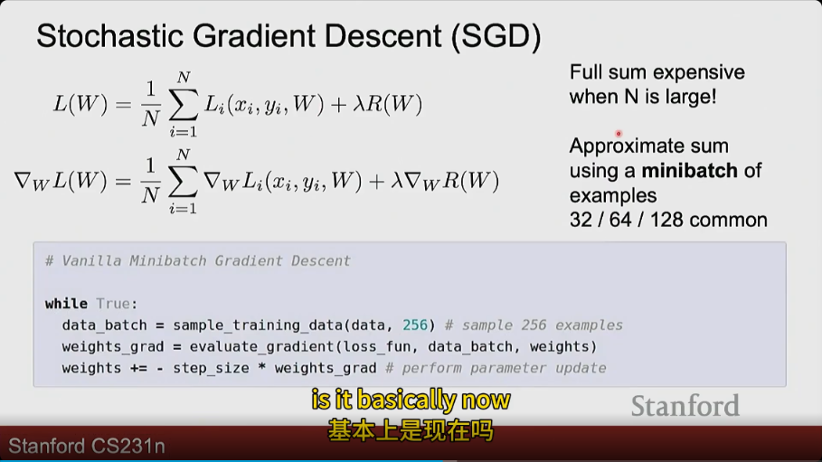
[00:36:58](https://www.bilibili.com/video/BV1YJ3PzLEiW/?p=3&spm_id_from=333.1007.top_right_bar_window_history.content.click&vd_source=2c95328d728d9b9a500883028f75d2f3)


[00:37:58](https://www.bilibili.com/video/BV1YJ3PzLEiW/?p=3&spm_id_from=333.1007.top_right_bar_window_history.content.click&vd_source=2c95328d728d9b9a500883028f75d2f3)

### 5.5 Problems with SGD

**Problem 1: Oscillation in Narrow Valleys**

- Large oscillations in steep directions
- Slow progress in gentle directions
- **Cause**: High condition number - large ratio of maximum/minimum eigenvalues of Hessian matrix

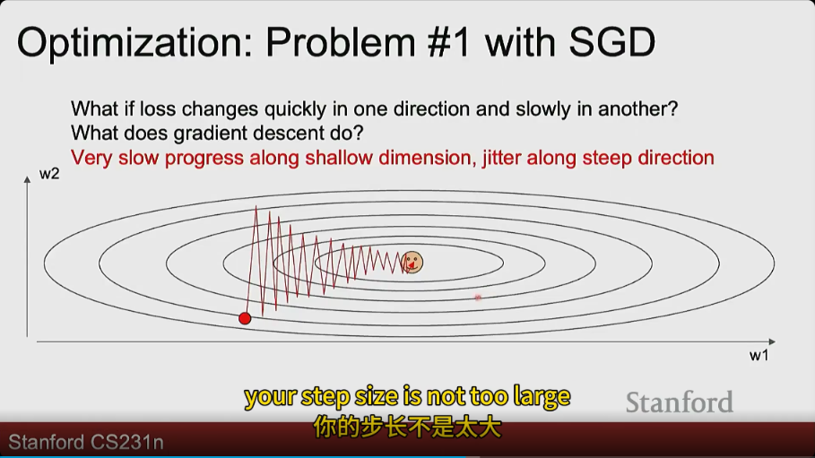
[00:39:13](https://www.bilibili.com/video/BV1YJ3PzLEiW/?p=3&spm_id_from=333.1007.top_right_bar_window_history.content.click&vd_source=2c95328d728d9b9a500883028f75d2f3)

**Problem 2: Local Optima and Saddle Points**

- **Local Optima**: Gradient is zero but not global optimum
- **Saddle Points**: Minimum in some directions, maximum in others
- Saddle points are more common in high-dimensional spaces

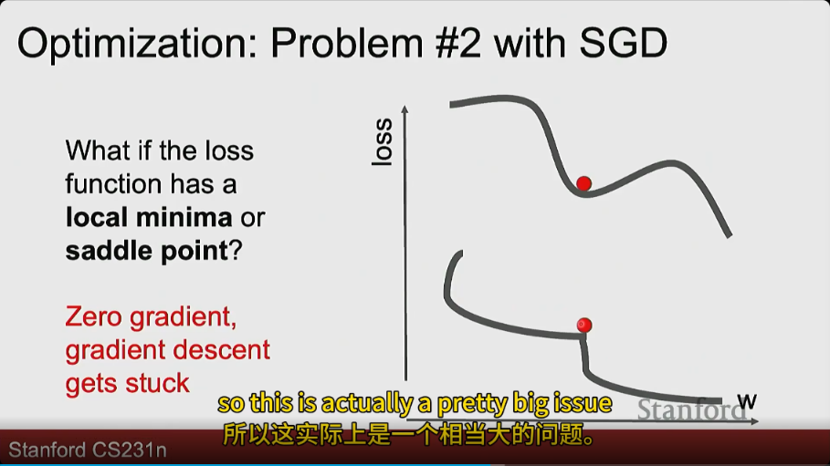
[00:40:34](https://www.bilibili.com/video/BV1YJ3PzLEiW/?p=3&spm_id_from=333.1007.top_right_bar_window_history.content.click&vd_source=2c95328d728d9b9a500883028f75d2f3)

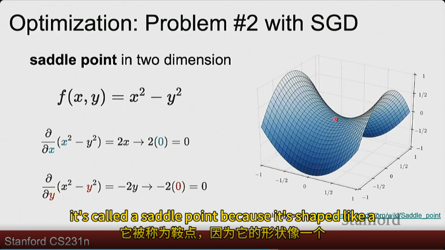
[00:41:43](https://www.bilibili.com/video/BV1YJ3PzLEiW/?p=3&spm_id_from=333.1007.top_right_bar_window_history.content.click&vd_source=2c95328d728d9b9a500883028f75d2f3)

**Problem 3: Gradient Noise**

- Mini-batch sampling introduces noise
- Update direction is imprecise

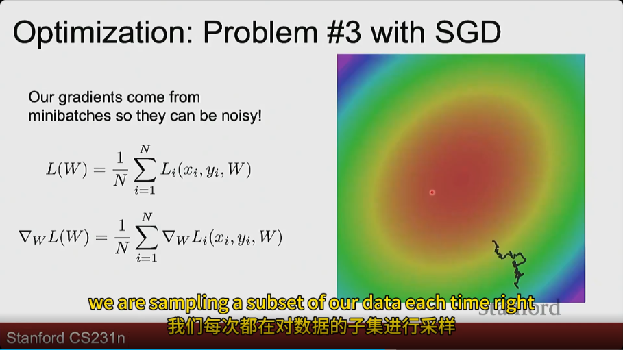
[00:42:25](https://www.bilibili.com/video/BV1YJ3PzLEiW/?p=3&spm_id_from=333.1007.top_right_bar_window_history.content.click&vd_source=2c95328d728d9b9a500883028f75d2f3)

### 5.6 Momentum

**Motivation**: Accumulate velocity like a rolling ball

**Algorithm**:

```python
v = 0  # Initialize velocity

while True:
    dW = compute_gradient(W, X_batch, y_batch)
    v = rho * v - learning_rate * dW  # Update velocity
    W = W + v                          # Update parameters
```

**Mathematical Form**:
$$\mathbf{v}_{t+1} = \rho \mathbf{v}_t + \nabla_{\mathbf{W}} L(\mathbf{W}_t)$$
$$\mathbf{W}_{t+1} = \mathbf{W}_t - \alpha \mathbf{v}_{t+1}$$

**Parameters**:

- $\rho$: Momentum coefficient (typically 0.9 or 0.99)
- High momentum → more reliance on historical direction

**Advantages**:

- Pass through local optima and saddle points
- Reduce oscillation in narrow valleys
- Accelerate in consistent directions
- Smooth gradient noise

**Equivalent Form**:
$$\mathbf{v}_{t+1} = \rho \mathbf{v}_t - \alpha \nabla_{\mathbf{W}} L(\mathbf{W}_t)$$
$$\mathbf{W}_{t+1} = \mathbf{W}_t + \mathbf{v}_{t+1}$$

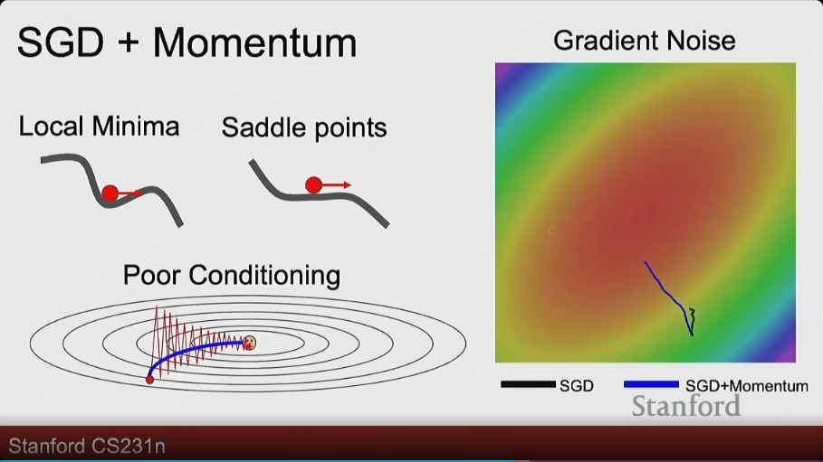
[00:42:59](https://www.bilibili.com/video/BV1YJ3PzLEiW/?p=3&spm_id_from=333.1007.top_right_bar_window_history.content.click&vd_source=2c95328d728d9b9a500883028f75d2f3)

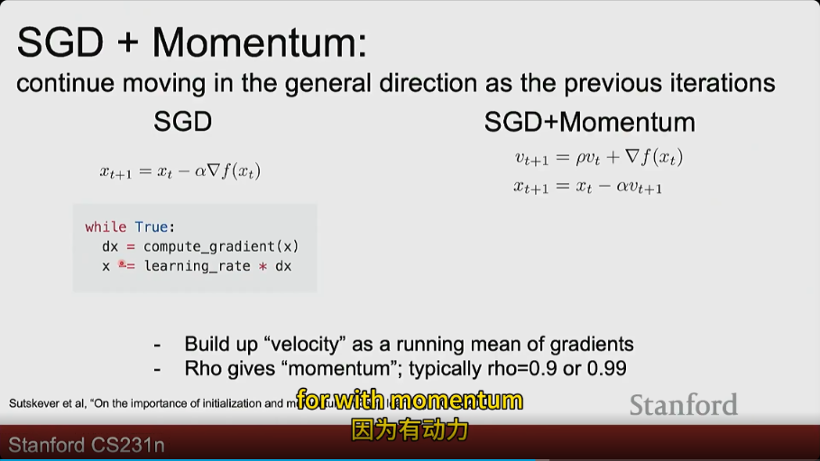
[00:44:48](https://www.bilibili.com/video/BV1YJ3PzLEiW/?p=3&spm_id_from=333.1007.top_right_bar_window_history.content.click&vd_source=2c95328d728d9b9a500883028f75d2f3)

### 5.7 RMSprop

**Motivation**: Adaptively adjust step size in different directions

**Algorithm**:

```python
grad_squared = 0

while True:
    dW = compute_gradient(W, X_batch, y_batch)
    grad_squared = decay_rate * grad_squared + (1 - decay_rate) * dW**2
    W = W - learning_rate * dW / (np.sqrt(grad_squared) + 1e-7)
```

**Mathematical Form**:
$$\mathbf{s}_t = \beta \mathbf{s}_{t-1} + (1-\beta) (\nabla_{\mathbf{W}} L)^2$$
$$\mathbf{W}_{t+1} = \mathbf{W}_t - \frac{\alpha}{\sqrt{\mathbf{s}_t} + \epsilon} \nabla_{\mathbf{W}} L$$

**Effect**:

- Reduce step size in steep directions (divide by large gradient squared)
- Increase step size in gentle directions (divide by small gradient squared)
- Automatically adapt to the geometry of loss landscape

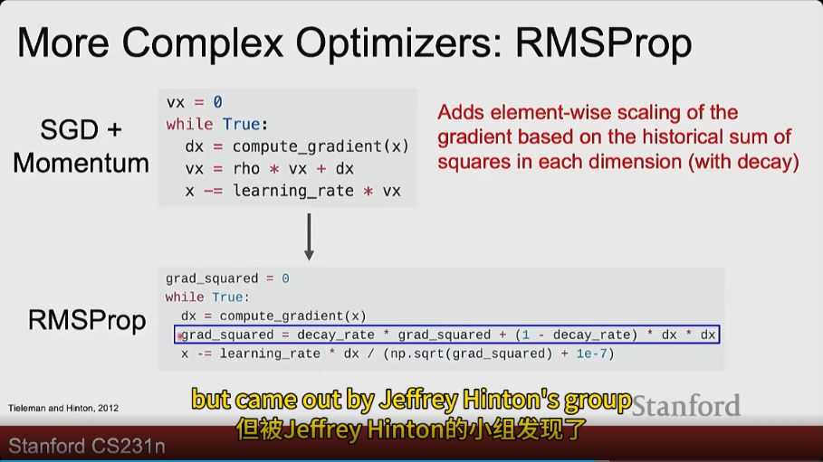
[00:49:38](https://www.bilibili.com/video/BV1YJ3PzLEiW/?p=3&spm_id_from=333.1007.top_right_bar_window_history.content.click&vd_source=2c95328d728d9b9a500883028f75d2f3)

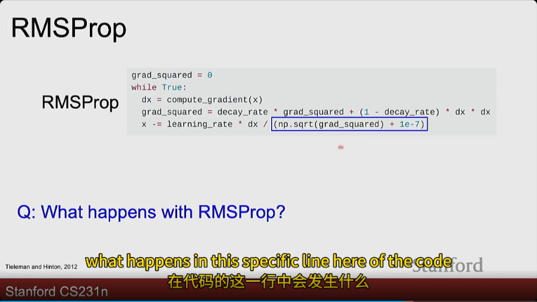
[00:51:36](https://www.bilibili.com/video/BV1YJ3PzLEiW/?p=3&spm_id_from=333.1007.top_right_bar_window_history.content.click&vd_source=2c95328d728d9b9a500883028f75d2f3)

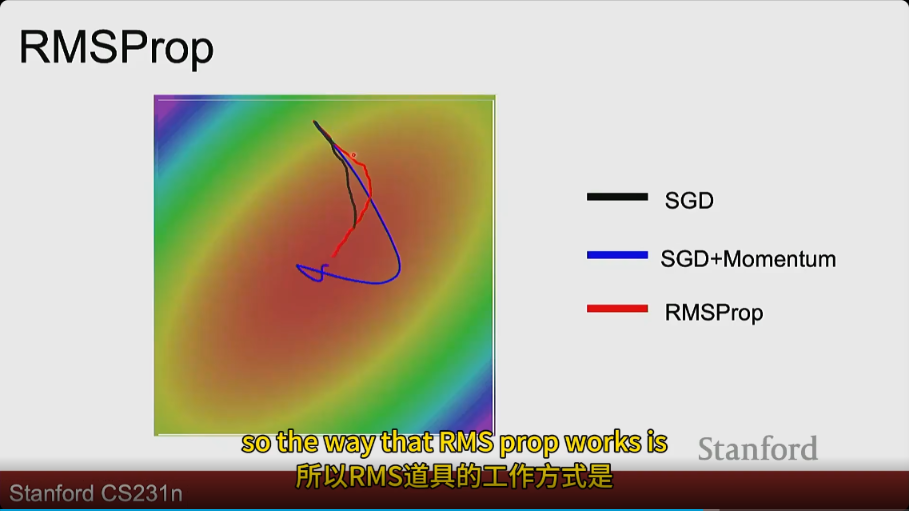
[00:53:06](https://www.bilibili.com/video/BV1YJ3PzLEiW/?p=3&spm_id_from=333.1007.top_right_bar_window_history.content.click&vd_source=2c95328d728d9b9a500883028f75d2f3)

### 5.8 Adam Optimizer (Most Popular)

**Adam = Momentum + RMSprop**

**Algorithm**:

```python
m = 0  # First moment estimate (momentum)
v = 0  # Second moment estimate (RMSprop)
t = 0  # Time step

while True:
    t += 1
    dW = compute_gradient(W, X_batch, y_batch)
    
    # Update first and second moment estimates
    m = beta1 * m + (1 - beta1) * dW
    v = beta2 * v + (1 - beta2) * (dW**2)
    
    # Bias correction
    m_hat = m / (1 - beta1**t)
    v_hat = v / (1 - beta2**t)
    
    # Parameter update
    W = W - learning_rate * m_hat / (np.sqrt(v_hat) + 1e-8)
```

**Mathematical Form**:
$$\mathbf{m}_t = \beta_1 \mathbf{m}_{t-1} + (1-\beta_1) \nabla_{\mathbf{W}} L$$
$$\mathbf{v}_t = \beta_2 \mathbf{v}_{t-1} + (1-\beta_2) (\nabla_{\mathbf{W}} L)^2$$
$$\hat{\mathbf{m}}_t = \frac{\mathbf{m}_t}{1-\beta_1^t}, \quad \hat{\mathbf{v}}_t = \frac{\mathbf{v}_t}{1-\beta_2^t}$$
$$\mathbf{W}_{t+1} = \mathbf{W}_t - \frac{\alpha}{\sqrt{\hat{\mathbf{v}}_t} + \epsilon} \hat{\mathbf{m}}_t$$

**Recommended Hyperparameters**:

- $\beta_1 = 0.9$
- $\beta_2 = 0.999$
- $\alpha = 1e-3$ or $5e-4$
- $\epsilon = 1e-8$

**Necessity of Bias Correction**:

- $\mathbf{m}_0 = \mathbf{v}_0 = 0$ (initialized to zero)
- In early time steps, moment estimates are biased toward zero
- Bias correction solves the problem of excessive step size in early stages

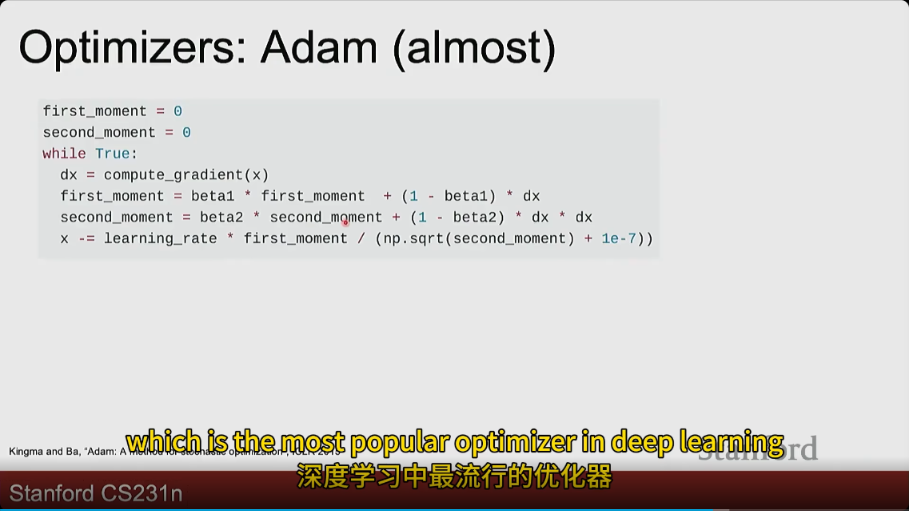
[00:53:50](https://www.bilibili.com/video/BV1YJ3PzLEiW/?p=3&spm_id_from=333.1007.top_right_bar_window_history.content.click&vd_source=2c95328d728d9b9a500883028f75d2f3)

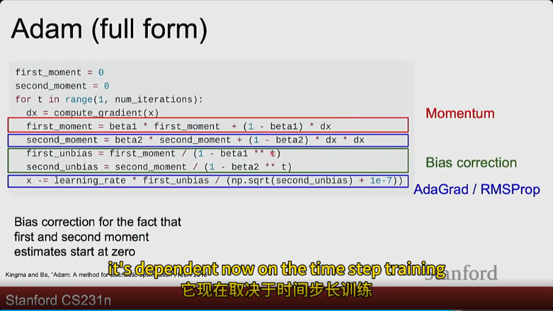
[00:56:09](https://www.bilibili.com/video/BV1YJ3PzLEiW/?p=3&spm_id_from=333.1007.top_right_bar_window_history.content.click&vd_source=2c95328d728d9b9a500883028f75d2f3)

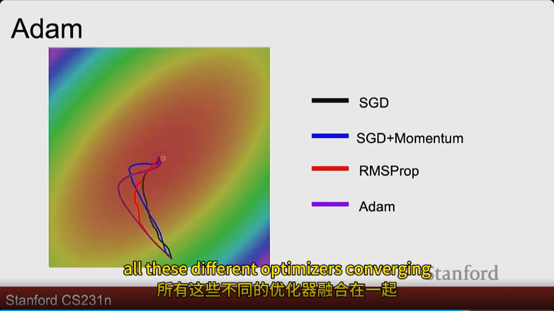
[00:57:05](https://www.bilibili.com/video/BV1YJ3PzLEiW/?p=3&spm_id_from=333.1007.top_right_bar_window_history.content.click&vd_source=2c95328d728d9b9a500883028f75d2f3)

### 5.9 AdamW (Adam with Decoupled Weight Decay)

**Key Difference**: Decouples weight decay from gradient

**Standard Adam**:

```python
dW = compute_gradient(W) + lambda * W  # L2 regularization term included in gradient
```

**AdamW**:

```python
dW = compute_gradient(W)  # Regularization term not included
W = W - lr * m / sqrt(v) - lr * lambda * W  # Apply weight decay separately
```

**Advantages**:

- Weight decay doesn't affect momentum computation
- Better separation of optimization and regularization
- Outperforms Adam on many tasks (e.g., Llama series models)

---

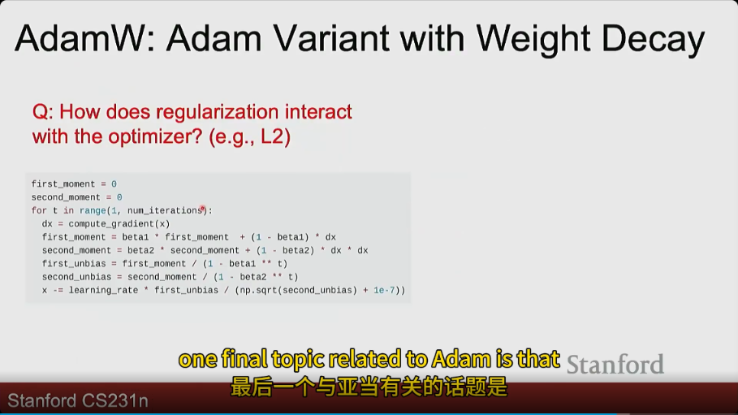
[00:57:22](https://www.bilibili.com/video/BV1YJ3PzLEiW/?p=3&spm_id_from=333.1007.top_right_bar_window_history.content.click&vd_source=2c95328d728d9b9a500883028f75d2f3)

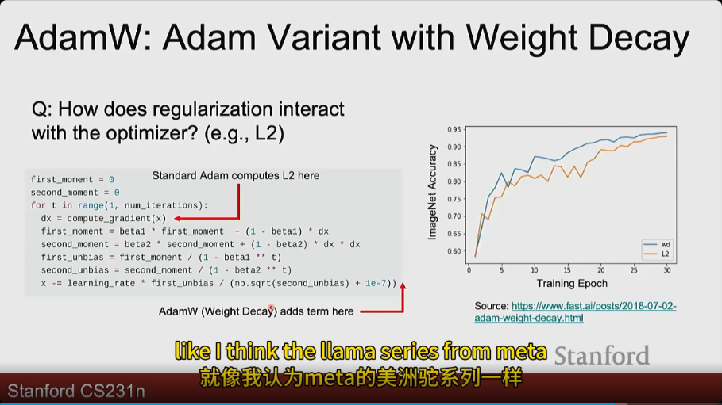
[00:58:27](https://www.bilibili.com/video/BV1YJ3PzLEiW/?p=3&spm_id_from=333.1007.top_right_bar_window_history.content.click&vd_source=2c95328d728d9b9a500883028f75d2f3)

## 6. Learning Rate Scheduling

### 6.1 Importance of Learning Rate

**Learning Rate Too High**:

- Loss value explodes
- Oscillates around optimum
- Cannot converge

**Learning Rate Too Low**:

- Extremely slow convergence
- May get stuck at saddle points

**Ideal Learning Rate**:

- Fast descent
- Stable convergence to lower loss

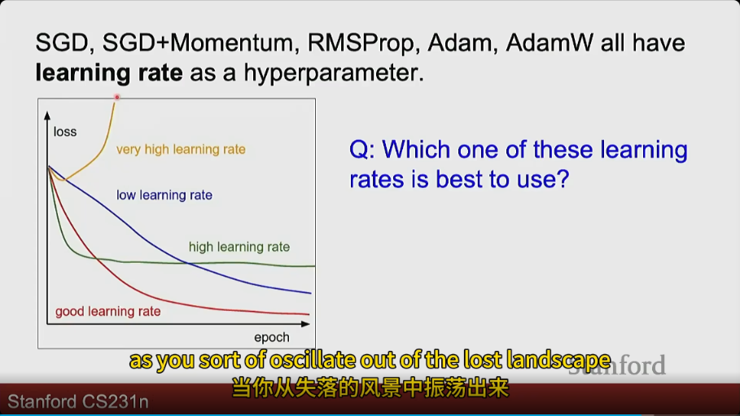
[00:59:30](https://www.bilibili.com/video/BV1YJ3PzLEiW/?p=3&spm_id_from=333.1007.top_right_bar_window_history.content.click&vd_source=2c95328d728d9b9a500883028f75d2f3)

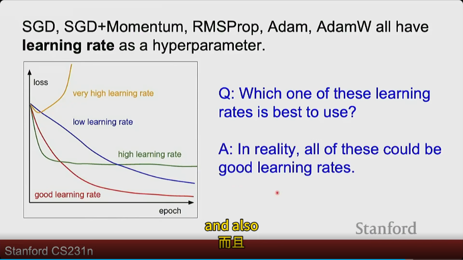
[01:00:04](https://www.bilibili.com/video/BV1YJ3PzLEiW/?p=3&spm_id_from=333.1007.top_right_bar_window_history.content.click&vd_source=2c95328d728d9b9a500883028f75d2f3)

### 6.2 Learning Rate Decay Strategies

**1. Step Decay**

```python
if epoch % step_size == 0:
    learning_rate *= gamma  # e.g., gamma=0.1
```

- Reduces learning rate at fixed epoch intervals
- Commonly used in ResNet training

**2. Cosine Annealing**
$$\alpha_t = \alpha_{\min} + \frac{1}{2}(\alpha_{\max} - \alpha_{\min})(1 + \cos(\frac{t\pi}{T}))$$

```python
lr = lr_min + 0.5 * (lr_max - lr_min) * (1 + np.cos(epoch / max_epoch * np.pi))
```

- Smoothly reduces learning rate
- Very popular

**3. Linear Decay**
$$\alpha_t = \alpha_0 (1 - \frac{t}{T})$$

**4. Inverse Square Root Decay**
$$\alpha_t = \frac{\alpha_0}{\sqrt{t}}$$

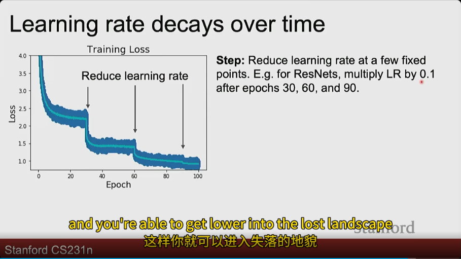
[01:00:44](https://www.bilibili.com/video/BV1YJ3PzLEiW/?p=3&spm_id_from=333.1007.top_right_bar_window_history.content.click&vd_source=2c95328d728d9b9a500883028f75d2f3)

### 6.3 Learning Rate Warmup

**Strategy**: Linearly increase learning rate in early training

```python
if epoch < warmup_epochs:
    lr = lr_max * epoch / warmup_epochs
else:
    lr = cosine_decay(epoch - warmup_epochs)
```

**Common Combinations**:

- Linear Warmup + Cosine Decay
- Linear Warmup + Step Decay

**Advantages**:

- Avoids instability from large initial steps
- Especially important in large batch size training

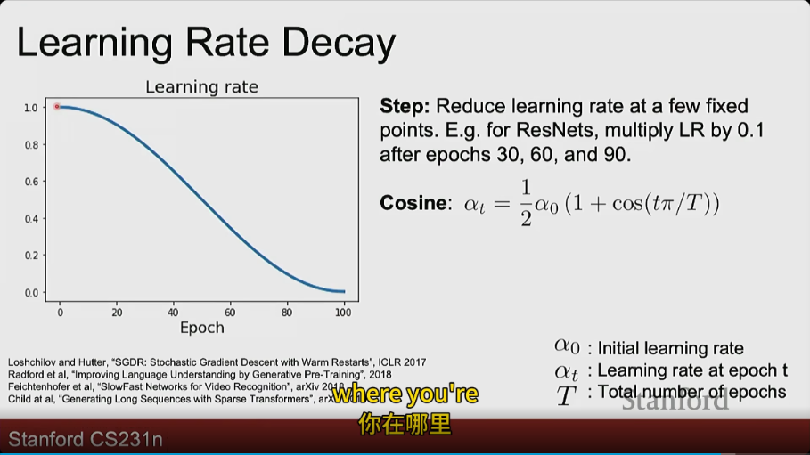
[01:01:06](https://www.bilibili.com/video/BV1YJ3PzLEiW/?p=3&spm_id_from=333.1007.top_right_bar_window_history.content.click&vd_source=2c95328d728d9b9a500883028f75d2f3)

### 6.4 Linear Scaling Rule

**Rule of Thumb**:
$$\text{Learning Rate} \propto \text{Batch Size}$$

**Example**:

- Batch size increases from 256 to 512
- Learning rate should also increase from 0.1 to 0.2

**Theoretical Basis**:

- Larger batch size gives more accurate gradient estimate
- Can use larger step size

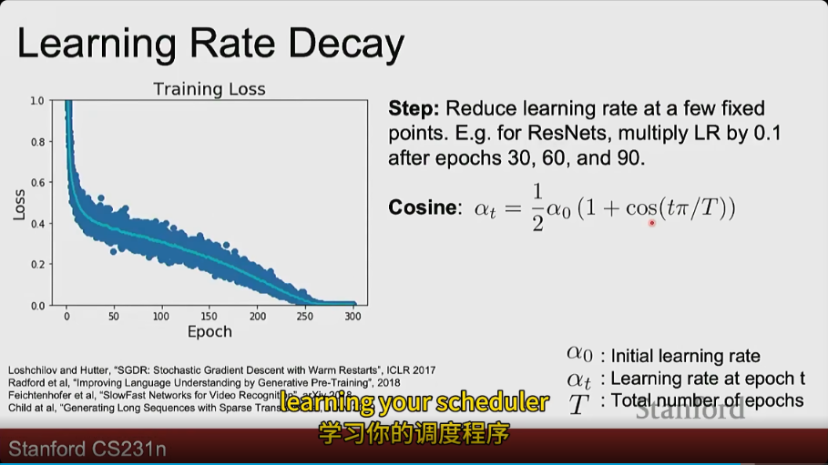
[01:01:24](https://www.bilibili.com/video/BV1YJ3PzLEiW/?p=3&spm_id_from=333.1007.top_right_bar_window_history.content.click&vd_source=2c95328d728d9b9a500883028f75d2f3)

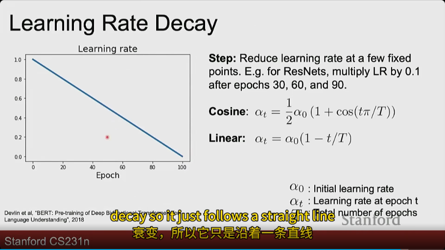
[01:01:48](https://www.bilibili.com/video/BV1YJ3PzLEiW/?p=3&spm_id_from=333.1007.top_right_bar_window_history.content.click&vd_source=2c95328d728d9b9a500883028f75d2f3)


[01:02:33](https://www.bilibili.com/video/BV1YJ3PzLEiW/?p=3&spm_id_from=333.1007.top_right_bar_window_history.content.click&vd_source=2c95328d728d9b9a500883028f75d2f3)

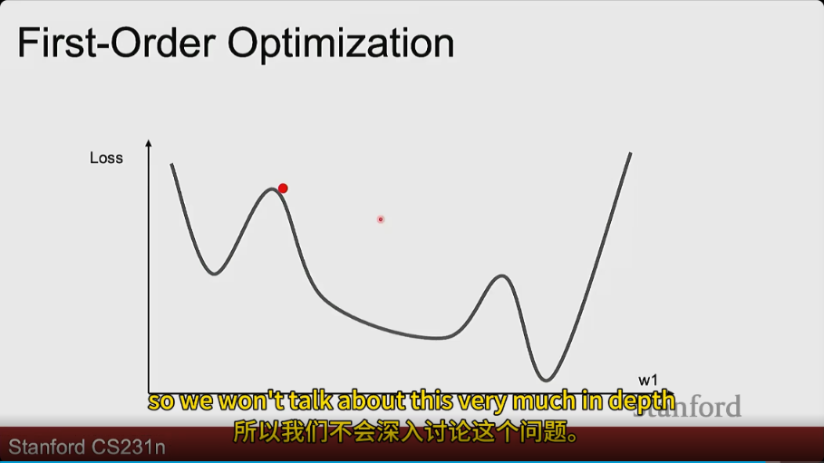
[01:03:47](https://www.bilibili.com/video/BV1YJ3PzLEiW/?p=3&spm_id_from=333.1007.top_right_bar_window_history.content.click&vd_source=2c95328d728d9b9a500883028f75d2f3)

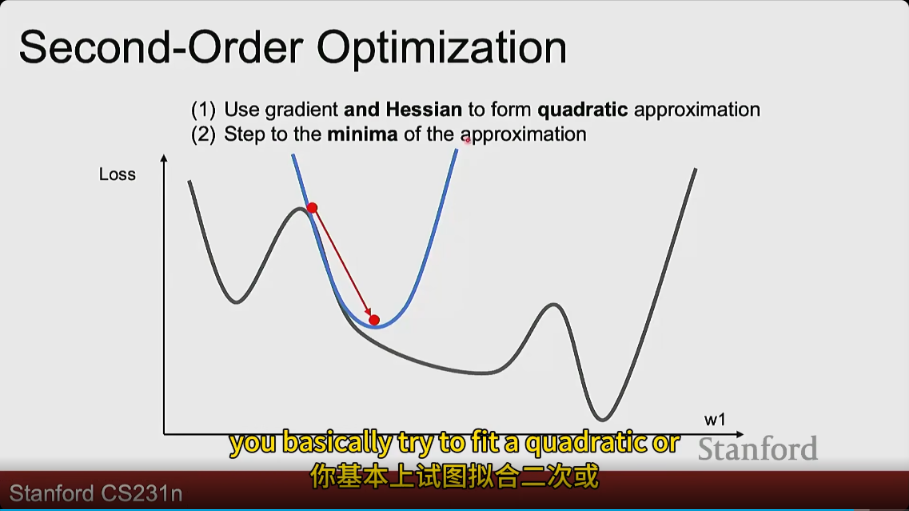
[01:04:28](https://www.bilibili.com/video/BV1YJ3PzLEiW/?p=3&spm_id_from=333.1007.top_right_bar_window_history.content.click&vd_source=2c95328d728d9b9a500883028f75d2f3)

## 7. Summary and Outlook

### 7.1 Key Points Summary

**Regularization**:

- Perform slightly worse on training data, better on test data
- L2 regularization prefers distributed weights, L1 prefers sparse weights
- Weight decay is a regularization strategy

**Optimization Algorithms**:

- **SGD**: Simple but may oscillate and get stuck at saddle points
- **Momentum**: Accumulates velocity, passes through local optima
- **RMSprop**: Adaptively adjusts step size in different directions
- **Adam/AdamW**: Combines Momentum and RMSprop, most commonly used

**Learning Rate Scheduling**:

- Dynamically adjust learning rate during training
- Warmup + Cosine Decay is a popular combination
- Linear Scaling Rule for adjusting batch size

### 7.2 Practical Recommendations

**Preferred Configuration**:

1. Optimizer: Adam or AdamW
2. Initial learning rate: 1e-3 or 5e-4
3. Scheduling strategy: Warmup + Cosine Decay
4. Beta values: $\beta_1=0.9, \beta_2=0.999$

**Debugging Tips**:

- Plot loss curves to judge if learning rate is appropriate
- Use gradient checking to verify backpropagation implementation
- Start with small models to validate the pipeline

### 7.3 Second-Order Optimization Methods (Brief Introduction)

**Newton's Method**:

- Uses Hessian matrix (second derivatives)
- Fits local quadratic function
- More precise step size selection

**Limitations**:

- Enormous computational and storage overhead for Hessian matrix ($O(D^2)$)
- Impractical for large-scale deep learning models
- Only feasible for small models

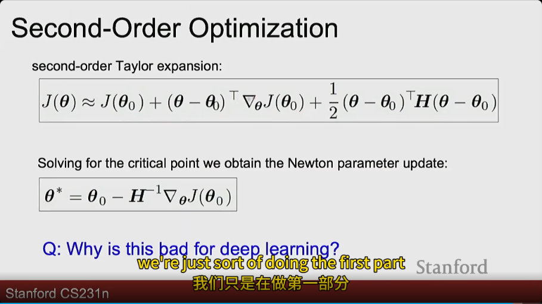
[01:04:55](https://www.bilibili.com/video/BV1YJ3PzLEiW/?p=3&spm_id_from=333.1007.top_right_bar_window_history.content.click&vd_source=2c95328d728d9b9a500883028f75d2f3)

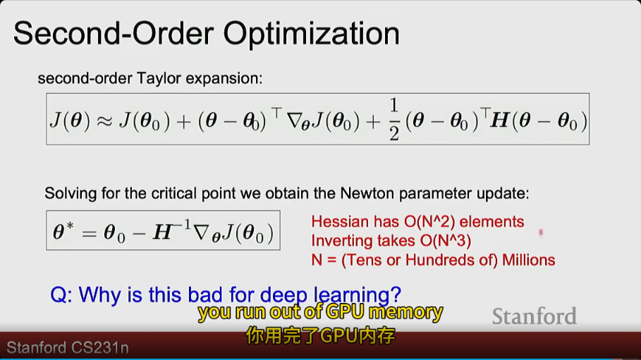
[01:05:28](https://www.bilibili.com/video/BV1YJ3PzLEiW/?p=3&spm_id_from=333.1007.top_right_bar_window_history.content.click&vd_source=2c95328d728d9b9a500883028f75d2f3)

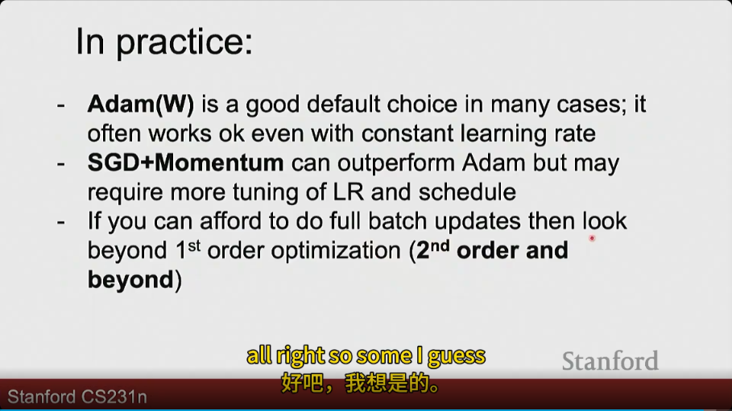
[01:05:59](https://www.bilibili.com/video/BV1YJ3PzLEiW/?p=3&spm_id_from=333.1007.top_right_bar_window_history.content.click&vd_source=2c95328d728d9b9a500883028f75d2f3)

### 7.4 Outlook: Neural Networks

**Next Lecture Topic**: Multi-layer Neural Networks

**Core Idea**:

- Stack multiple linear layers
- Insert nonlinear activation functions between layers (e.g., ReLU)
- Can learn nonlinear decision boundaries

**Example**:
$$\mathbf{h} = \text{ReLU}(\mathbf{W}_1 \mathbf{x} + \mathbf{b}_1)$$
$$\mathbf{y} = \mathbf{W}_2 \mathbf{h} + \mathbf{b}_2$$

**Advantages**:

- Can handle linearly non-separable data
- Learn complex feature representations through multi-layer transformations

---

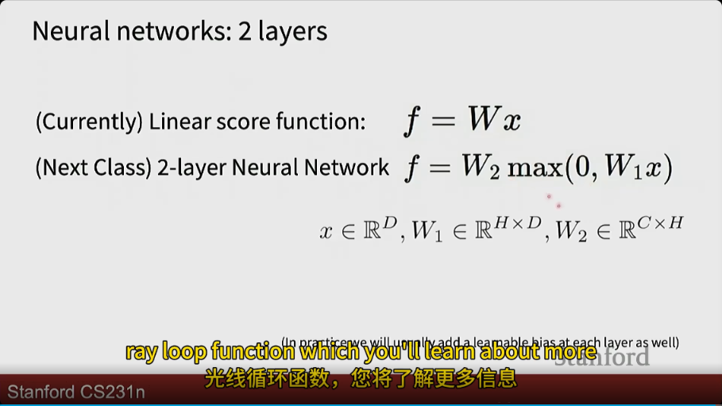
[01:08:02](https://www.bilibili.com/video/BV1YJ3PzLEiW/?p=3&spm_id_from=333.1007.top_right_bar_window_history.content.click&vd_source=2c95328d728d9b9a500883028f75d2f3)

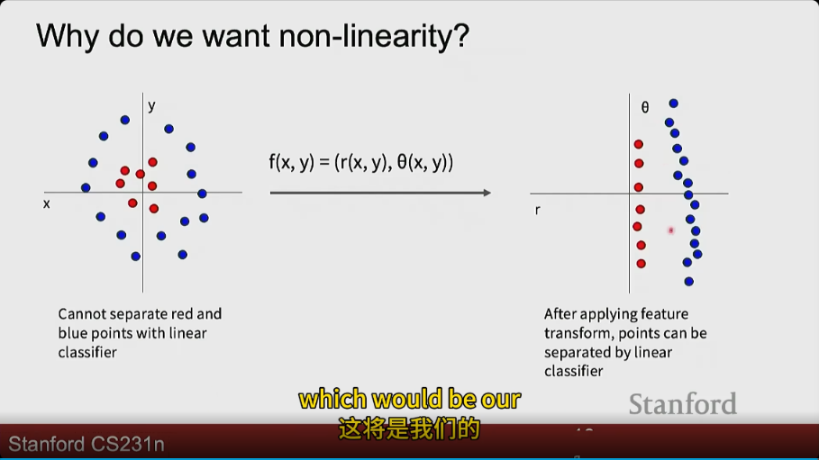
[01:08:31](https://www.bilibili.com/video/BV1YJ3PzLEiW/?p=3&spm_id_from=333.1007.top_right_bar_window_history.content.click&vd_source=2c95328d728d9b9a500883028f75d2f3)

## References

1. **CS231n Course Notes**: http://cs231n.github.io/
2. **Optimization Algorithm Papers**:
   - Adam: Kingma & Ba, 2014
   - AdamW: Loshchilov & Hutter, 2017
3. **Related Concepts**:
   - Condition Number
   - Hessian Matrix
   - Convex Optimization

---

## Appendix: Important Formulas Summary

**Loss Function**:
$$L = \frac{1}{N} \sum_{i=1}^{N} L_i + \lambda R(\mathbf{W})$$

**L2 Regularization**:
$$R(\mathbf{W}) = \sum_{i,j} W_{i,j}^2$$

**L1 Regularization**:
$$R(\mathbf{W}) = \sum_{i,j} |W_{i,j}|$$

**Gradient Descent**:
$$\mathbf{W}_{t+1} = \mathbf{W}_t - \alpha \nabla_{\mathbf{W}} L$$

**Momentum**:
$$\mathbf{v}_{t+1} = \rho \mathbf{v}_t + \nabla_{\mathbf{W}} L, \quad \mathbf{W}_{t+1} = \mathbf{W}_t - \alpha \mathbf{v}_{t+1}$$

**Adam**:
$$\mathbf{m}_t = \beta_1 \mathbf{m}_{t-1} + (1-\beta_1) \nabla L$$
$$\mathbf{v}_t = \beta_2 \mathbf{v}_{t-1} + (1-\beta_2) (\nabla L)^2$$
$$\mathbf{W}_{t+1} = \mathbf{W}_t - \frac{\alpha}{\sqrt{\hat{\mathbf{v}}_t} + \epsilon} \hat{\mathbf{m}}_t$$
