# Lecture 2: Image Classification & Linear Classifiers

## 课程概述

本节课是CS231N计算机视觉课程的第二讲，主要内容包括：

- 图像分类任务的定义与挑战
- 数据驱动方法（Data-Driven Approach）
- K近邻算法（K-Nearest Neighbor, KNN）
- 超参数调优策略
- 线性分类器（Linear Classifier）
- Softmax分类器与损失函数

**学习目标**：

1. 理解图像分类的核心挑战
2. 掌握数据驱动方法的三步流程
3. 理解K近邻算法的工作原理及其局限性
4. 学习超参数调优的最佳实践
5. 掌握线性分类器的代数、视觉和几何解释
6. 理解Softmax分类器和交叉熵损失函数

---

## 目录

1. [图像分类任务定义](#1-图像分类任务定义)
2. [图像分类的核心挑战](#2-图像分类的核心挑战)
3. [数据驱动方法](#3-数据驱动方法)
4. [K近邻算法（KNN）](#4-k近邻算法knn)
5. [超参数调优](#5-超参数调优)
6. [线性分类器](#6-线性分类器)
7. [Softmax分类器与损失函数](#7-softmax分类器与损失函数)
8. [核心要点总结](#核心要点总结)
9. [参考资料](#参考资料)

---

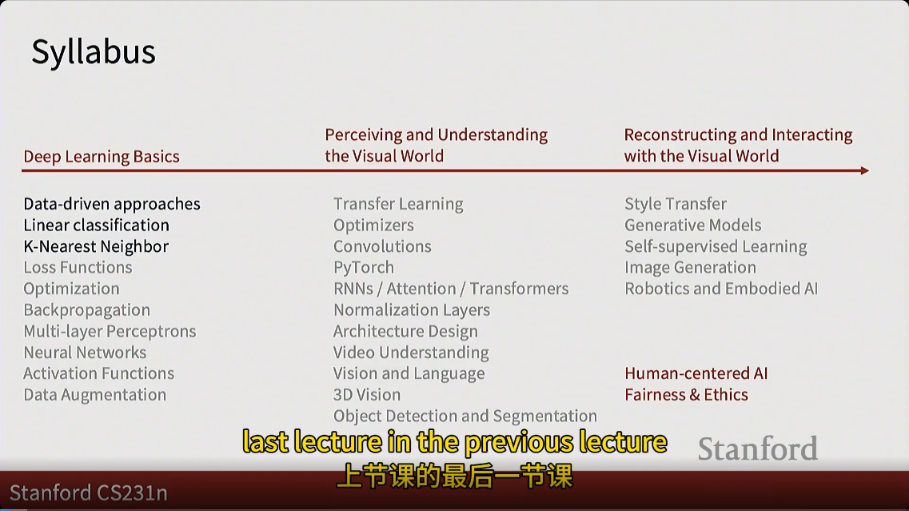
[00:00:48](https://www.bilibili.com/video/BV1YJ3PzLEiW/?p=2&spm_id_from=333.1007.top_right_bar_window_history.content.click&vd_source=2c95328d728d9b9a500883028f75d2f3)

## 1. 图像分类任务定义

### 1.1 什么是图像分类？

**图像分类（Image Classification）**是计算机视觉中的核心任务之一，其定义为：

- **输入**：一张图像
- **输出**：从预定义标签集合中选择一个标签
- **目标**：为输入图像分配正确的类别标签


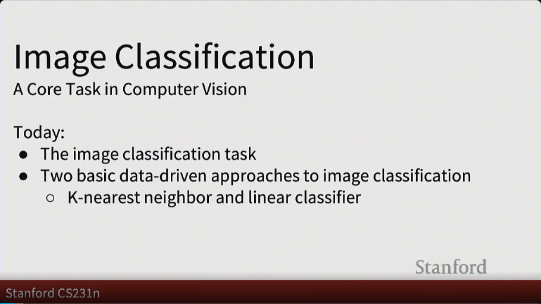
[00:01:45](https://www.bilibili.com/video/BV1YJ3PzLEiW/?p=2&spm_id_from=333.1007.top_right_bar_window_history.content.click&vd_source=2c95328d728d9b9a500883028f75d2f3)

**示例**：给定一张图像和标签集合 {cat, dog, truck, plane, ...}，系统需要输出"cat"

### 1.2 语义鸿沟（Semantic Gap）

对人类而言，图像分类是一个极其简单的任务，因为我们的认知系统能够整体理解图像。但对计算机来说，这是一个巨大的挑战：

- **人类视角**：看到一只猫
- **计算机视角**：看到一个数字矩阵（张量）

**图像的数字表示**：

```
图像尺寸：800 × 600 像素
RGB三通道：Red, Green, Blue
数据结构：800 × 600 × 3 的三维张量
像素值范围：0-255（8位数据）
```

每个像素的RGB值是一个介于0-255之间的整数，这是标准的24位（3×8位）RGB格式。

---

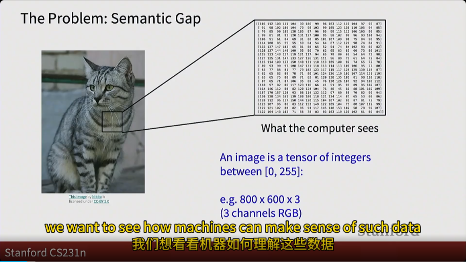
[00:03:50](https://www.bilibili.com/video/BV1YJ3PzLEiW/?p=2&spm_id_from=333.1007.top_right_bar_window_history.content.click&vd_source=2c95328d728d9b9a500883028f75d2f3)

## 2. 图像分类的核心挑战

### 2.1 视角变化（Viewpoint Variation）

**问题**：即使物体保持静止，仅仅移动相机（平移、旋转）就会导致所有像素值发生变化。

- 对人类：同一个物体
- 对计算机：完全不同的数据点（800×600×3 = 1,440,000个数值全部改变）

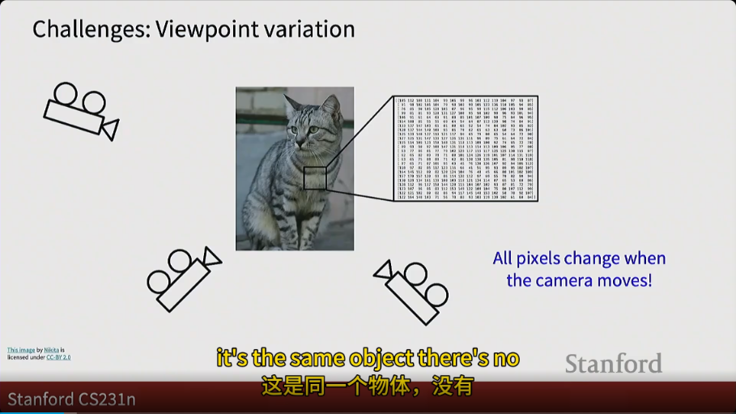
[00:05:50](https://www.bilibili.com/video/BV1YJ3PzLEiW/?p=2&spm_id_from=333.1007.top_right_bar_window_history.content.click&vd_source=2c95328d728d9b9a500883028f75d2f3)

### 2.2 光照变化（Illumination）

**问题**：RGB像素值是光照条件的函数。

$$\text{Pixel Value} = f(\text{Object Reflectance}, \text{Light Source}, \text{Camera Response})$$

同一物体在不同光照下会产生不同的像素值：

- 明亮阳光下的猫
- 黑暗房间里的猫
- 对人类：都是同一只猫
- 对计算机：完全不同的数值

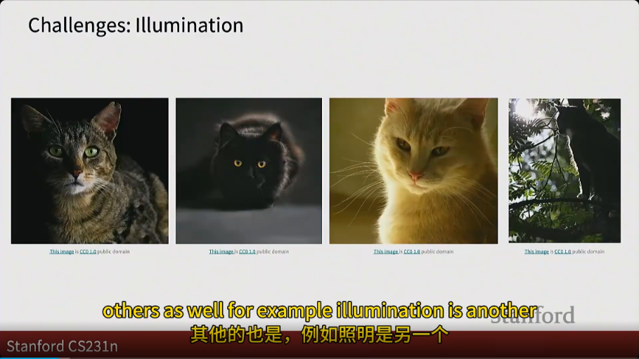
[00:06:09](https://www.bilibili.com/video/BV1YJ3PzLEiW/?p=2&spm_id_from=333.1007.top_right_bar_window_history.content.click&vd_source=2c95328d728d9b9a500883028f75d2f3)

### 2.3 其他主要挑战

| 挑战类型     | 描述                  | 影响                               |
| ------------ | --------------------- | ---------------------------------- |
| **背景杂乱** | Background Clutter    | 目标物体可能与背景混淆             |
| **尺度变化** | Scale Variation       | 物体在图像中的大小不一             |
| **遮挡**     | Occlusion             | 物体的部分被遮挡                   |
| **形变**     | Deformation           | 物体形状变化（如猫的不同姿态）     |
| **类内差异** | Intra-class Variation | 同类物体外观差异大（不同品种的猫） |

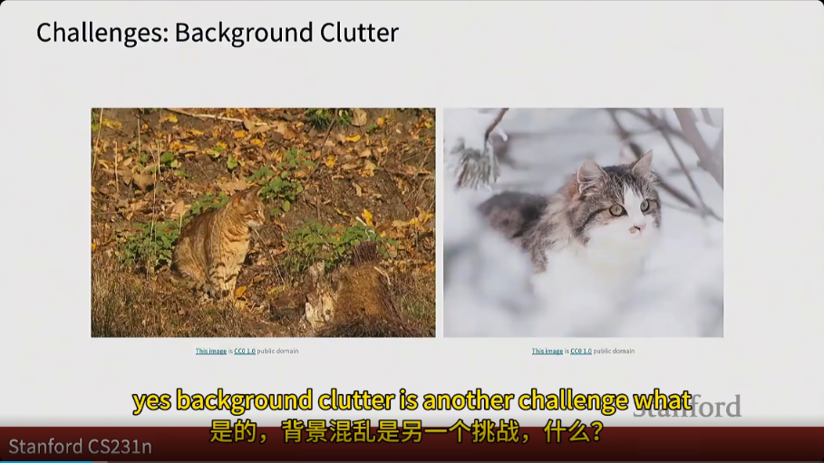
[00:07:34](https://www.bilibili.com/video/BV1YJ3PzLEiW/?p=2&spm_id_from=333.1007.top_right_bar_window_history.content.click&vd_source=2c95328d728d9b9a500883028f75d2f3)


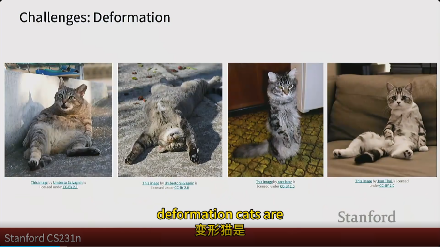
[00:09:03](https://www.bilibili.com/video/BV1YJ3PzLEiW/?p=2&spm_id_from=333.1007.top_right_bar_window_history.content.click&vd_source=2c95328d728d9b9a500883028f75d2f3)

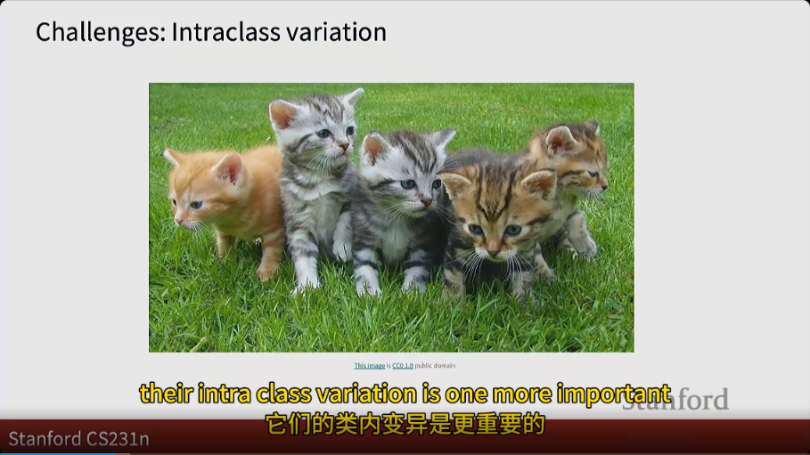
[00:09:35](https://www.bilibili.com/video/BV1YJ3PzLEiW/?p=2&spm_id_from=333.1007.top_right_bar_window_history.content.click&vd_source=2c95328d728d9b9a500883028f75d2f3)

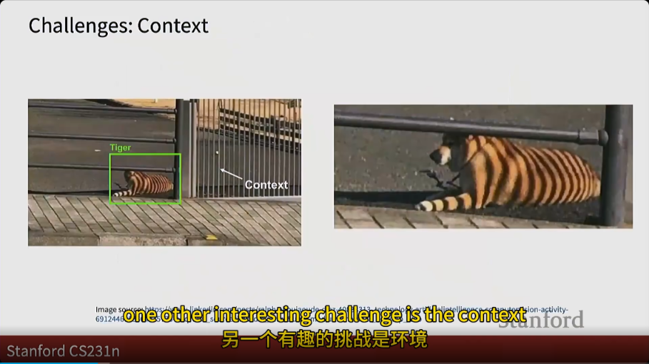
[00:10:06](https://www.bilibili.com/video/BV1YJ3PzLEiW/?p=2&spm_id_from=333.1007.top_right_bar_window_history.content.click&vd_source=2c95328d728d9b9a500883028f75d2f3)

### 2.4 遮挡问题示例

即使只能看到猫尾巴和一小部分毛发，人类也能根据**上下文**（客厅、沙发）推断这是一只猫，而不是老虎或浣熊。

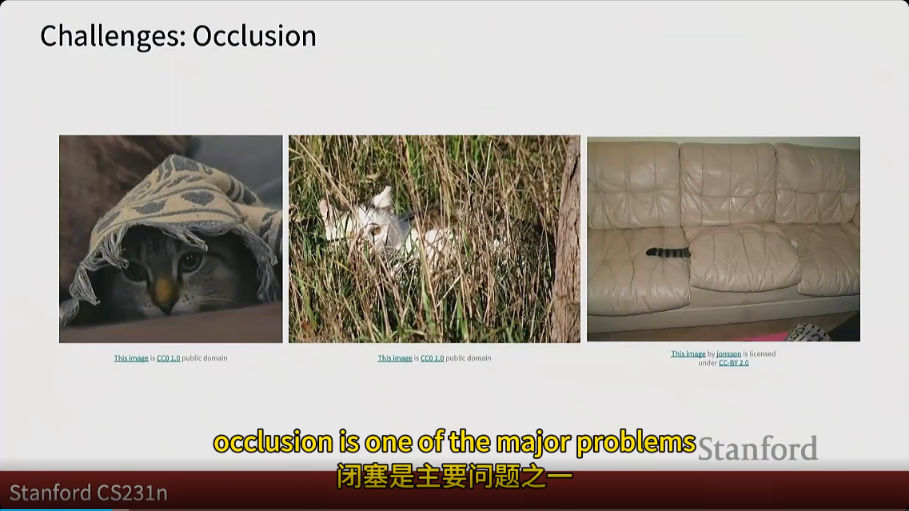
[00:08:16](https://www.bilibili.com/video/BV1YJ3PzLEiW/?p=2&spm_id_from=333.1007.top_right_bar_window_history.content.click&vd_source=2c95328d728d9b9a500883028f75d2f3)

## 3. 数据驱动方法

### 3.1 传统方法的局限性

**基于规则的方法**（如边缘检测）：

```python
# 伪代码示例
def recognize_cat(image):
    edges = detect_edges(image)
    corners = find_corners(edges)
    features = extract_features(corners)
    if matches_cat_pattern(features):
        return "cat"
```

**问题**：

- 难以扩展（每个类别都需要手工设计规则）
- 泛化能力差
- 对变化敏感


[00:10:56](https://www.bilibili.com/video/BV1YJ3PzLEiW/?p=2&spm_id_from=333.1007.top_right_bar_window_history.content.click&vd_source=2c95328d728d9b9a500883028f75d2f3)

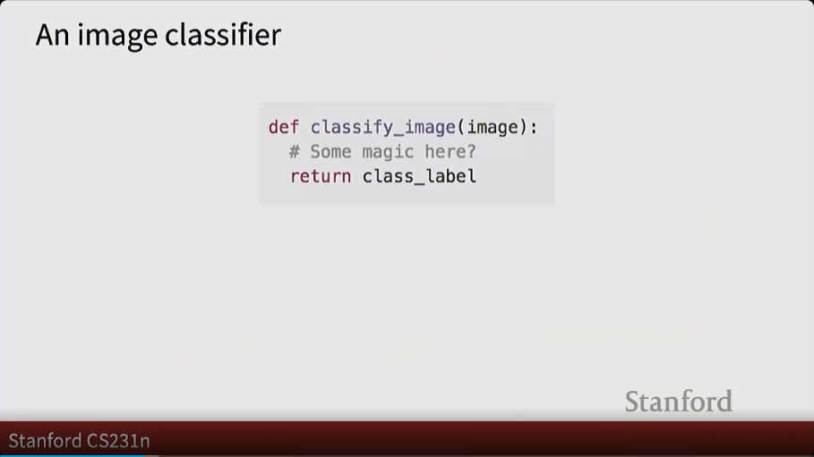
[00:11:53](https://www.bilibili.com/video/BV1YJ3PzLEiW/?p=2&spm_id_from=333.1007.top_right_bar_window_history.content.click&vd_source=2c95328d728d9b9a500883028f75d2f3)

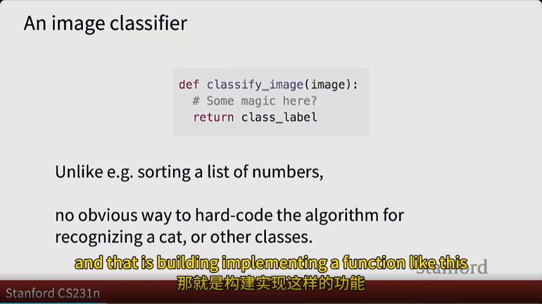
[00:12:00](https://www.bilibili.com/video/BV1YJ3PzLEiW/?p=2&spm_id_from=333.1007.top_right_bar_window_history.content.click&vd_source=2c95328d728d9b9a500883028f75d2f3)

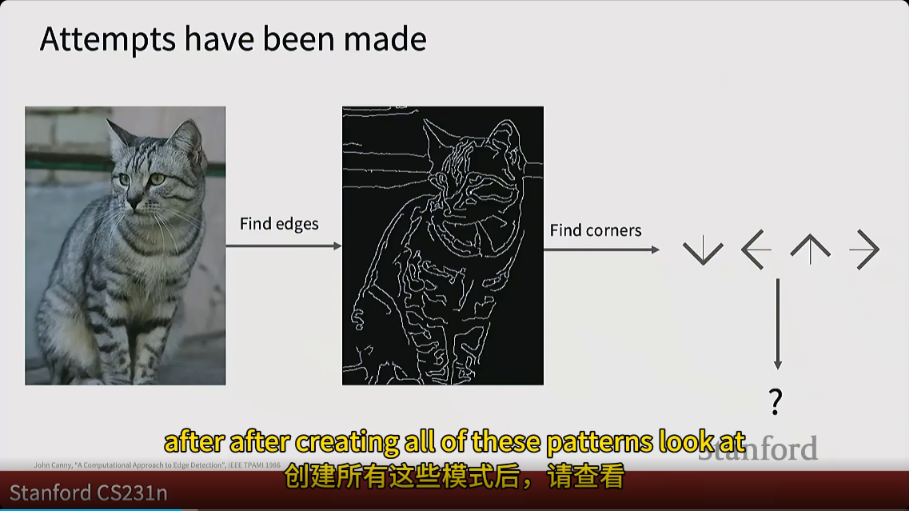
[00:13:24](https://www.bilibili.com/video/BV1YJ3PzLEiW/?p=2&spm_id_from=333.1007.top_right_bar_window_history.content.click&vd_source=2c95328d728d9b9a500883028f75d2f3)

---

### 3.2 数据驱动的三步流程

现代机器学习采用**数据驱动方法**，包含三个核心步骤：

**步骤1：收集数据集**

- 收集大量图像及其对应标签
- 示例数据集：ImageNet, CIFAR-10, CIFAR-100

**步骤2：训练分类器**

```python
def train(images, labels):
    """
    使用机器学习算法训练模型
    输入：训练图像和标签
    输出：训练好的模型
    """
    model = build_model()
    model.fit(images, labels)
    return model
```

**步骤3：评估分类器**

```python
def predict(model, test_images):
    """
    在新图像上测试模型
    输入：模型和测试图像
    输出：预测标签
    """
    predictions = model.predict(test_images)
    return predictions
```

---

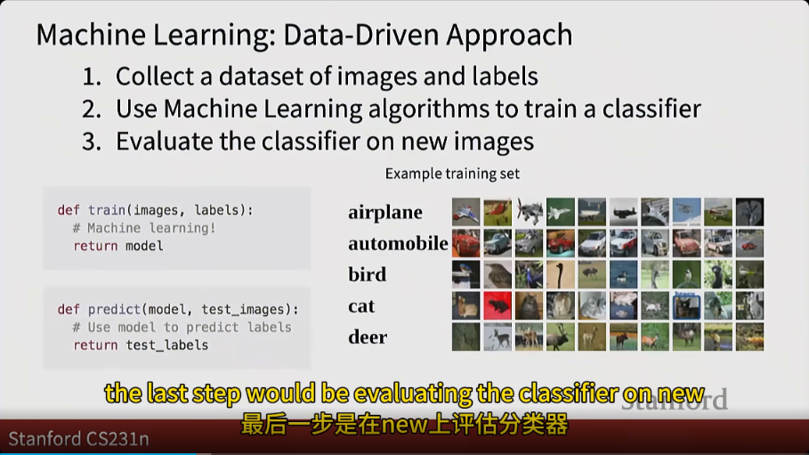
[00:16:15](https://www.bilibili.com/video/BV1YJ3PzLEiW/?p=2&spm_id_from=333.1007.top_right_bar_window_history.content.click&vd_source=2c95328d728d9b9a500883028f75d2f3)

## 4. K近邻算法（KNN）

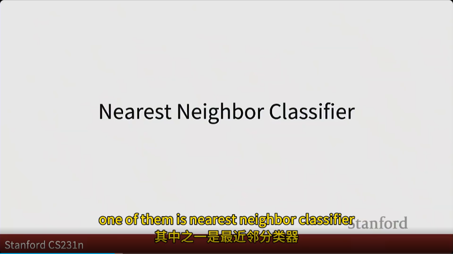
[00:16:58](https://www.bilibili.com/video/BV1YJ3PzLEiW/?p=2&spm_id_from=333.1007.top_right_bar_window_history.content.click&vd_source=2c95328d728d9b9a500883028f75d2f3)

### 4.1 算法原理

K近邻是最简单的数据驱动方法之一，其核心思想是：**相似的输入应该产生相似的输出**。

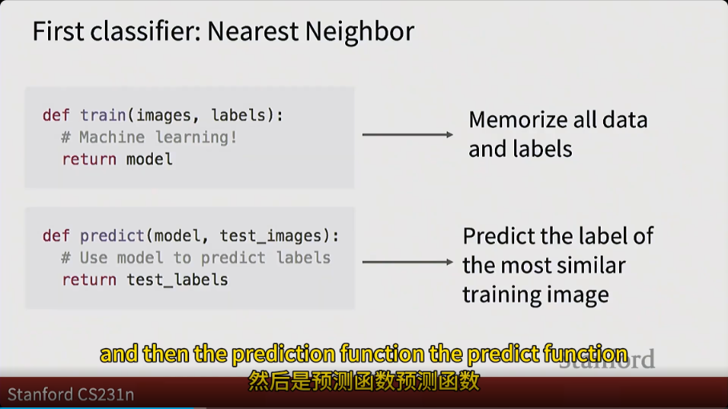
[00:17:50](https://www.bilibili.com/video/BV1YJ3PzLEiW/?p=2&spm_id_from=333.1007.top_right_bar_window_history.content.click&vd_source=2c95328d728d9b9a500883028f75d2f3)

### 4.2 算法实现

**训练阶段**：

```python
def train(images, labels):
    """
    训练函数：仅仅记忆所有数据
    时间复杂度：O(1)
    """
    # 将所有训练数据存储在内存中
    self.train_images = images
    self.train_labels = labels
```

**预测阶段**：

```python
def predict(test_image):
    """
    预测函数：找到最相似的训练图像
    时间复杂度：O(N) - N为训练样本数
    """
    # 计算测试图像与所有训练图像的距离
    distances = compute_distances(test_image, self.train_images)
    
    # 找到K个最近邻
    k_nearest = find_k_smallest(distances, k)
    
    # 投票决定标签
    predicted_label = majority_vote(k_nearest)
    return predicted_label
```

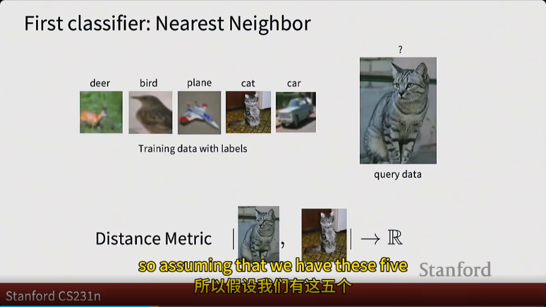
[00:18:19](https://www.bilibili.com/video/BV1YJ3PzLEiW/?p=2&spm_id_from=333.1007.top_right_bar_window_history.content.click&vd_source=2c95328d728d9b9a500883028f75d2f3)


### 4.3 距离度量

#### L1 距离（曼哈顿距离）

$$d_{L1}(I_1, I_2) = \sum_{p} |I_1^p - I_2^p|$$

其中 $p$ 遍历所有像素位置。

**实现示例**：

```python
import numpy as np

def L1_distance(image1, image2):
    """
    计算两张图像的L1距离
    """
    return np.sum(np.abs(image1 - image2))
```


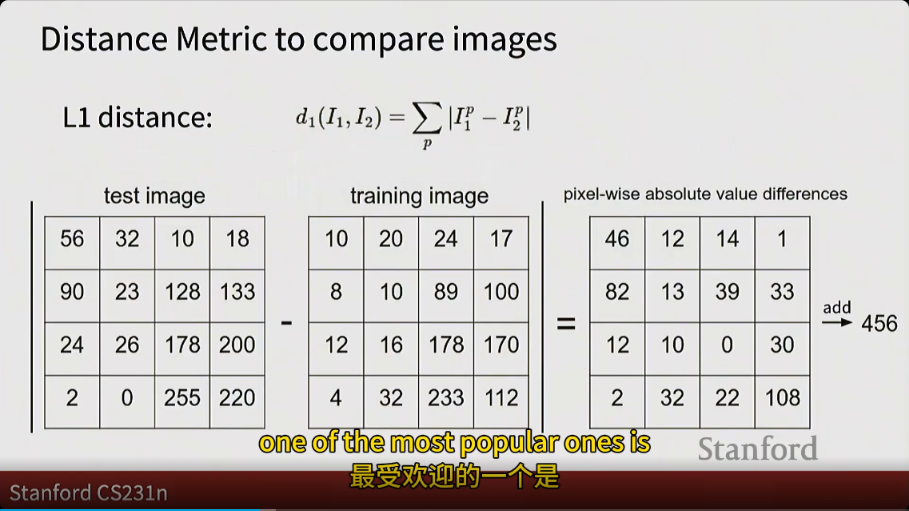
[00:19:10](https://www.bilibili.com/video/BV1YJ3PzLEiW/?p=2&spm_id_from=333.1007.top_right_bar_window_history.content.click&vd_source=2c95328d728d9b9a500883028f75d2f3)

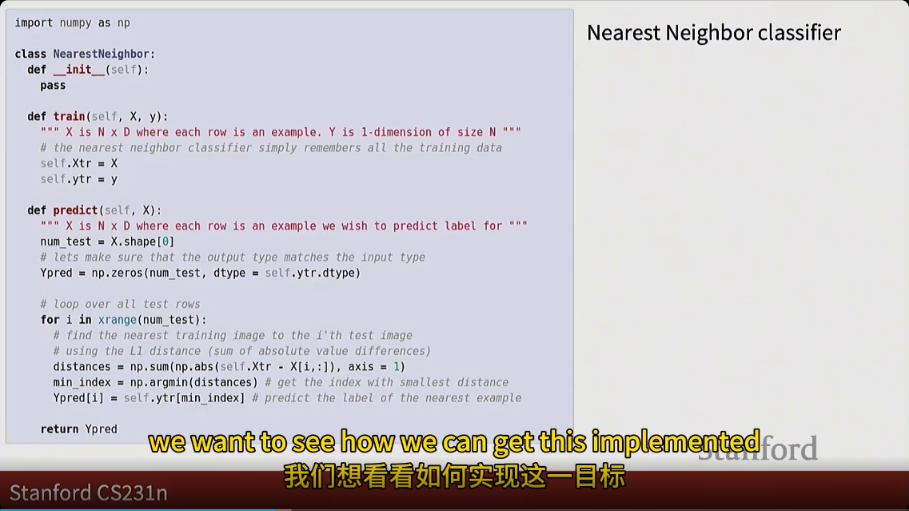
[00:20:16](https://www.bilibili.com/video/BV1YJ3PzLEiW/?p=2&spm_id_from=333.1007.top_right_bar_window_history.content.click&vd_source=2c95328d728d9b9a500883028f75d2f3)


[00:20:36](https://www.bilibili.com/video/BV1YJ3PzLEiW/?p=2&spm_id_from=333.1007.top_right_bar_window_history.content.click&vd_source=2c95328d728d9b9a500883028f75d2f3)

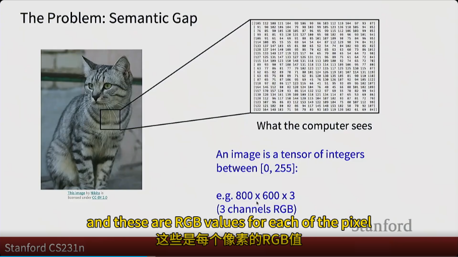
[00:21:31](https://www.bilibili.com/video/BV1YJ3PzLEiW/?p=2&spm_id_from=333.1007.top_right_bar_window_history.content.click&vd_source=2c95328d728d9b9a500883028f75d2f3)

---

### 4.5 KNN的优缺点

**优点**：
✓ 实现简单
✓ 易于理解
✓ 训练时间为O(1)

**缺点**：
✗ 预测时间为O(N)，效率低下
✗ 需要存储所有训练数据
✗ 基于像素的距离语义意义不强
✗ 对高维数据效果差（维度灾难）

**计算复杂度分析**：

| 阶段 | 时间复杂度 | 说明                   |
| ---- | ---------- | ---------------------- |
| 训练 | O(1)       | 仅存储数据             |
| 预测 | O(N)       | 需要与所有训练样本比较 |

这与理想情况相反：我们希望训练慢、预测快，因为训练可以离线进行。

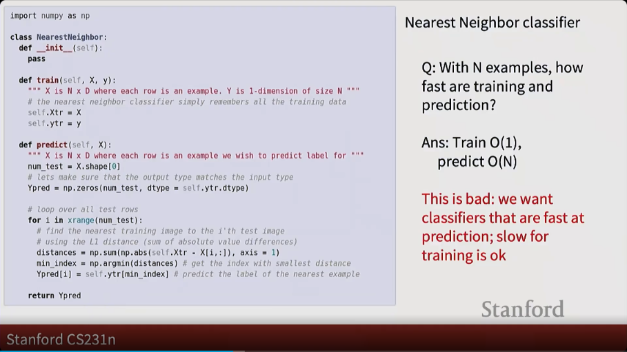
[00:24:56](https://www.bilibili.com/video/BV1YJ3PzLEiW/?p=2&spm_id_from=333.1007.top_right_bar_window_history.content.click&vd_source=2c95328d728d9b9a500883028f75d2f3)

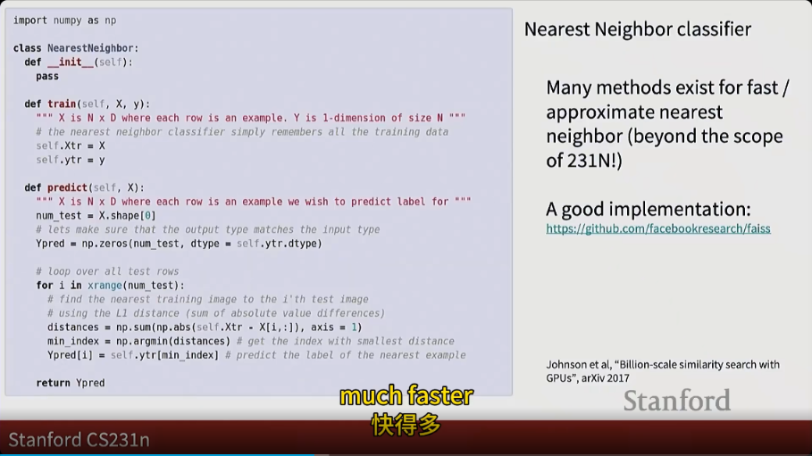
[00:25:56](https://www.bilibili.com/video/BV1YJ3PzLEiW/?p=2&spm_id_from=333.1007.top_right_bar_window_history.content.click&vd_source=2c95328d728d9b9a500883028f75d2f3)

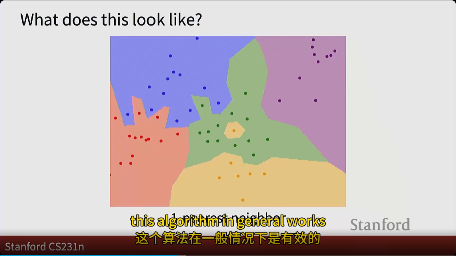
[00:26:10](https://www.bilibili.com/video/BV1YJ3PzLEiW/?p=2&spm_id_from=333.1007.top_right_bar_window_history.content.click&vd_source=2c95328d728d9b9a500883028f75d2f3)

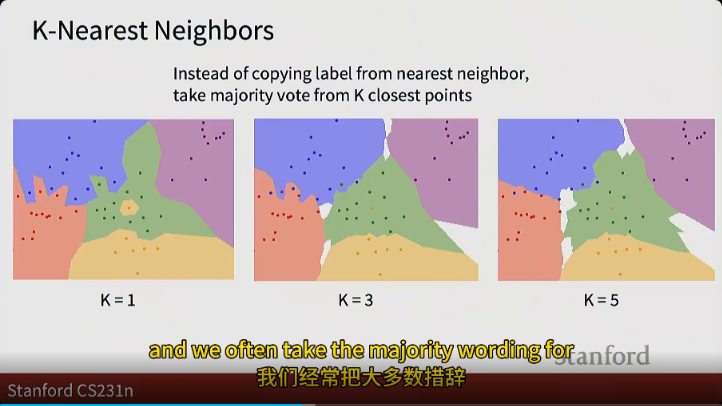
[00:28:03](https://www.bilibili.com/video/BV1YJ3PzLEiW/?p=2&spm_id_from=333.1007.top_right_bar_window_history.content.click&vd_source=2c95328d728d9b9a500883028f75d2f3)

**特点**：

- 对坐标轴旋转敏感
- 适合特征具有明确物理意义的情况

#### L2 距离（欧氏距离）

$$d_{L2}(I_1, I_2) = \sqrt{\sum_{p} (I_1^p - I_2^p)^2}$$

```python
def L2_distance(image1, image2):
    """
    计算两张图像的L2距离
    """
    return np.sqrt(np.sum((image1 - image2) ** 2))
```

**特点**：

- 对坐标轴旋转不敏感
- 更常用于一般情况

#### L1 vs L2 可视化

在2D空间中：

- **L1距离**：等距线形成菱形（正方形旋转45°）
- **L2距离**：等距线形成圆形

```
L1: 到原点距离为r的点集形成正方形
    |x| + |y| = r

L2: 到原点距离为r的点集形成圆形
    √(x² + y²) = r
```

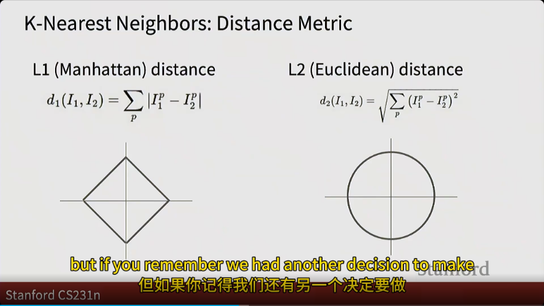
[00:29:26](https://www.bilibili.com/video/BV1YJ3PzLEiW/?p=2&spm_id_from=333.1007.top_right_bar_window_history.content.click&vd_source=2c95328d728d9b9a500883028f75d2f3)

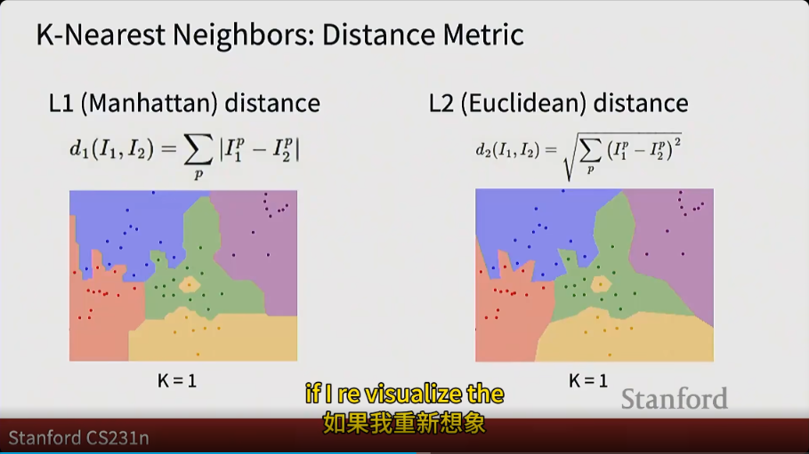
[00:34:29](https://www.bilibili.com/video/BV1YJ3PzLEiW/?p=2&spm_id_from=333.1007.top_right_bar_window_history.content.click&vd_source=2c95328d728d9b9a500883028f75d2f3)

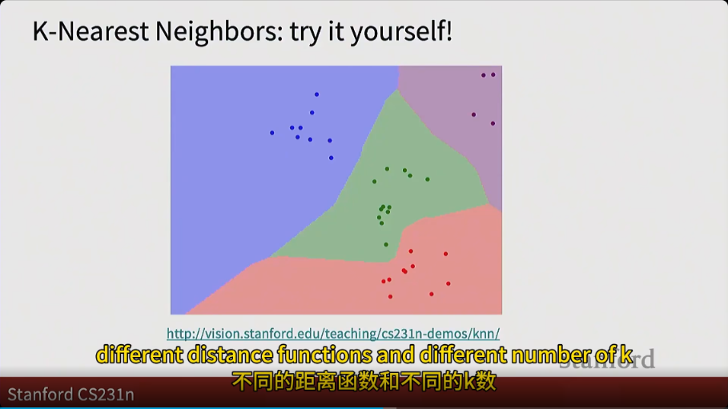
[00:35:17](https://www.bilibili.com/video/BV1YJ3PzLEiW/?p=2&spm_id_from=333.1007.top_right_bar_window_history.content.click&vd_source=2c95328d728d9b9a500883028f75d2f3)

---

### 4.4 K值的选择

**K=1（最近邻）**：

- 优点：简单直接
- 缺点：对噪声敏感，决策边界不平滑

**K>1（K近邻）**：

- 优点：对噪声更鲁棒
- 缺点：可能出现投票平局

**决策边界可视化**：

- K=1：决策边界呈锯齿状，容易过拟合
- K=3,5,7：决策边界更平滑
- K过大：可能导致欠拟合

## 5. 超参数调优

### 5.1 什么是超参数？

**超参数（Hyperparameters）**是在训练开始前需要设定的参数，例如：

- K近邻中的K值
- 距离度量函数（L1, L2, etc.）
- 学习率（后续课程）
- 正则化强度（后续课程）

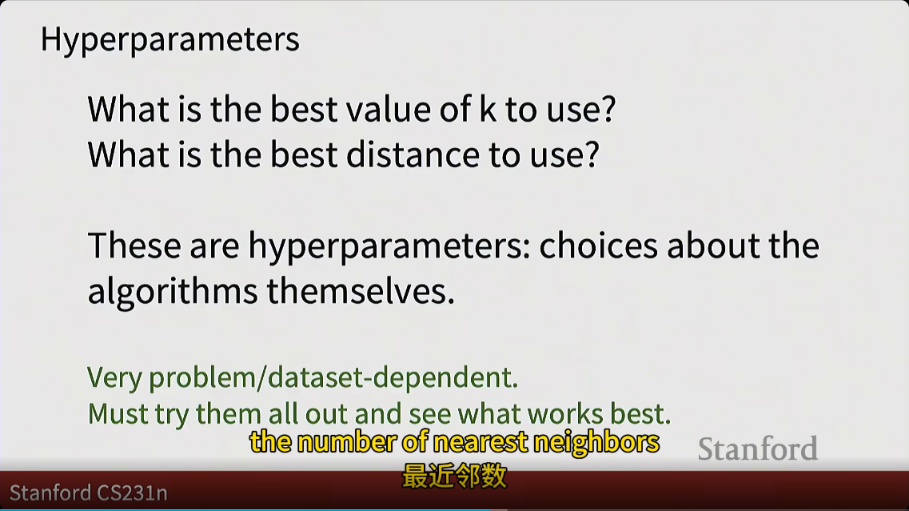
[00:36:10](https://www.bilibili.com/video/BV1YJ3PzLEiW/?p=2&spm_id_from=333.1007.top_right_bar_window_history.content.click&vd_source=2c95328d728d9b9a500883028f75d2f3)

### 5.2 设置超参数的方法

#### 方法1：在训练集上选择（❌ 不推荐）

```python
# 错误示例
best_k = None
best_accuracy = 0
for k in [1, 3, 5, 7, 9]:
    accuracy = evaluate_on_train(k)  # 在训练集上评估
    if accuracy > best_accuracy:
        best_k = k
        best_accuracy = accuracy
```

**问题**：

- K=1总是能在训练集上达到100%准确率（记忆训练数据）
- 无法评估泛化能力

#### 方法2：在测试集上选择（❌ 不推荐）

```python
# 错误示例
best_k = None
best_accuracy = 0
for k in [1, 3, 5, 7, 9]:
    accuracy = evaluate_on_test(k)  # 在测试集上评估
    if accuracy > best_accuracy:
        best_k = k
        best_accuracy = accuracy
```

**问题**：

- 相当于"作弊"
- 无法评估模型在真正未见过数据上的表现
- 过拟合测试集

#### 方法3：使用验证集（✓ 推荐）

```python
# 正确示例
# 步骤1：划分数据
train_set, val_set, test_set = split_data(data)

# 步骤2：在验证集上选择超参数
best_k = None
best_val_accuracy = 0
for k in [1, 3, 5, 7, 9]:
    model = train(train_set, k)
    val_accuracy = evaluate(model, val_set)
    if val_accuracy > best_val_accuracy:
        best_k = k
        best_val_accuracy = val_accuracy

# 步骤3：用最佳超参数在测试集上评估
final_model = train(train_set, best_k)
test_accuracy = evaluate(final_model, test_set)
```

**数据划分示例**：

- 训练集：50,000样本（用于训练模型）
- 验证集：10,000样本（用于选择超参数）
- 测试集：10,000样本（用于最终评估）

#### 方法4：交叉验证（✓✓ 最推荐，但计算昂贵）

**K折交叉验证**：

```python
def cross_validation(data, k_folds=5):
    """
    K折交叉验证
    """
    fold_size = len(data) // k_folds
    accuracies = []
    
    for fold in range(k_folds):
        # 划分数据
        val_start = fold * fold_size
        val_end = (fold + 1) * fold_size
        
        val_set = data[val_start:val_end]
        train_set = data[:val_start] + data[val_end:]
        
        # 训练和评估
        model = train(train_set)
        accuracy = evaluate(model, val_set)
        accuracies.append(accuracy)
    
    return np.mean(accuracies)
```

**5折交叉验证示意图**：

```
Fold 1: [Val][Train][Train][Train][Train]
Fold 2: [Train][Val][Train][Train][Train]
Fold 3: [Train][Train][Val][Train][Train]
Fold 4: [Train][Train][Train][Val][Train]
Fold 5: [Train][Train][Train][Train][Val]
```

**优点**：

- 更可靠的超参数选择
- 充分利用数据
- 减少随机性影响

**缺点**：

- 计算成本高（需要训练K次）
- 在深度学习中较少使用（数据集大，训练耗时）


[00:38:41](https://www.bilibili.com/video/BV1YJ3PzLEiW/?p=2&spm_id_from=333.1007.top_right_bar_window_history.content.click&vd_source=2c95328d728d9b9a500883028f75d2f3)

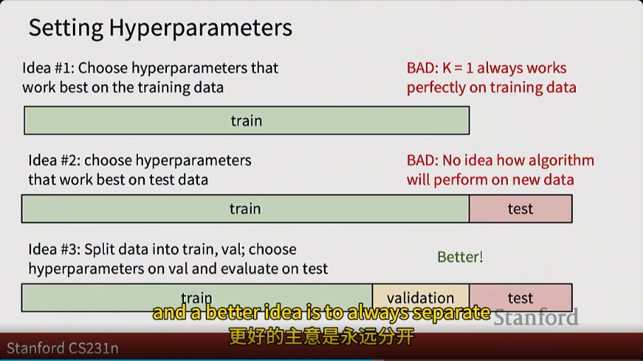
[00:38:46](https://www.bilibili.com/video/BV1YJ3PzLEiW/?p=2&spm_id_from=333.1007.top_right_bar_window_history.content.click&vd_source=2c95328d728d9b9a500883028f75d2f3)

### 5.3 最佳实践

**小数据集**：

- 使用交叉验证

**大数据集**：

- 使用单个验证集
- 依赖经验和直觉

**永远不要**：

- 在测试集上调整超参数
- 在训练集上评估泛化性能


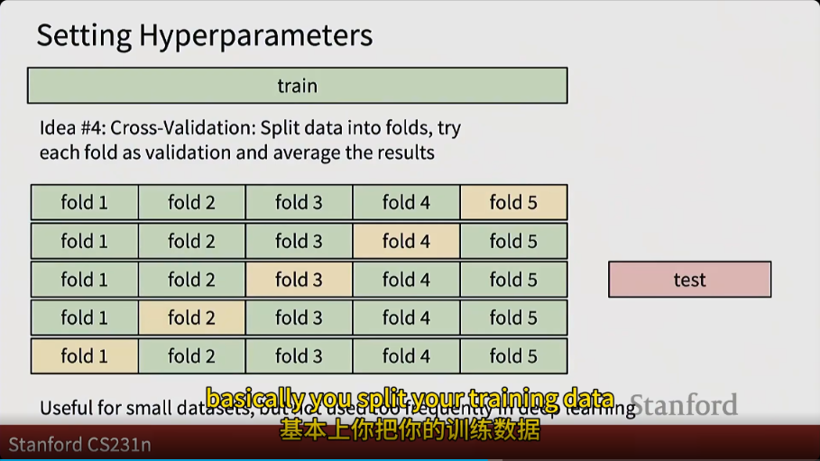
[00:39:52](https://www.bilibili.com/video/BV1YJ3PzLEiW/?p=2&spm_id_from=333.1007.top_right_bar_window_history.content.click&vd_source=2c95328d728d9b9a500883028f75d2f3)

### 5.4 CIFAR-10 实验结果

**数据集**：

- 10个类别
- 50,000训练图像
- 10,000测试图像
- 图像尺寸：32×32×3

**实验设置**：

- 使用5折交叉验证
- 测试不同K值（K=1,3,5,7,9,11...）

**结果**：

- 最佳K值：K=7
- 最佳准确率：~29%
- 随机猜测基准：10%（10个类别）

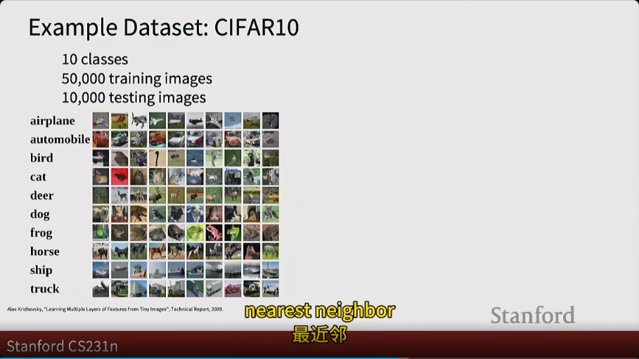
[00:41:40](https://www.bilibili.com/video/BV1YJ3PzLEiW/?p=2&spm_id_from=333.1007.top_right_bar_window_history.content.click&vd_source=2c95328d728d9b9a500883028f75d2f3)

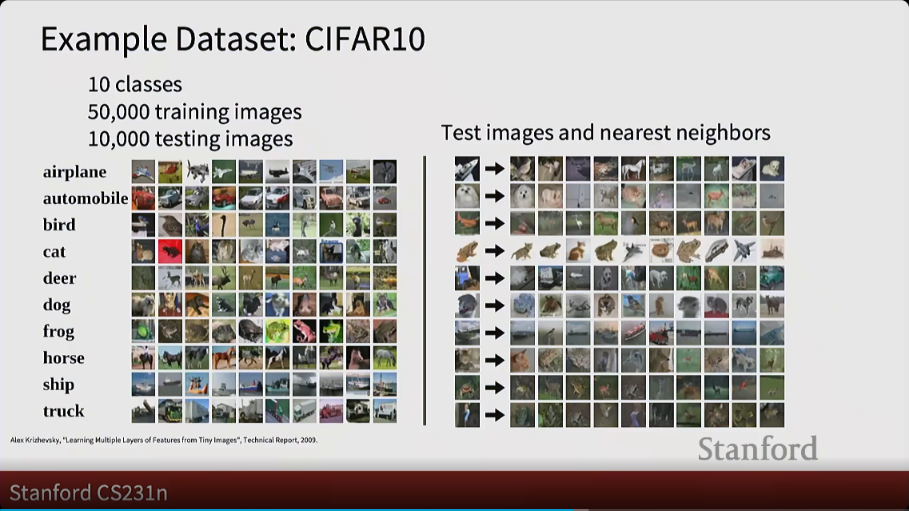
[00:42:15](https://www.bilibili.com/video/BV1YJ3PzLEiW/?p=2&spm_id_from=333.1007.top_right_bar_window_history.content.click&vd_source=2c95328d728d9b9a500883028f75d2f3)

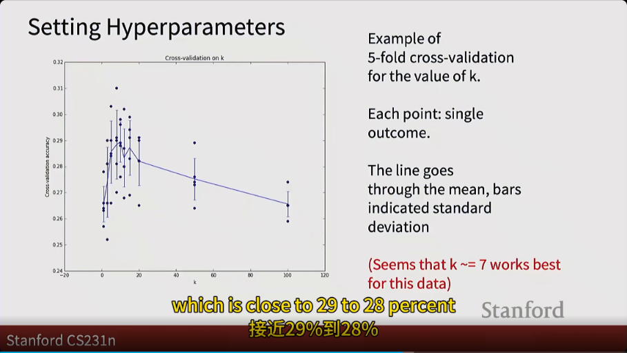
[00:43:04](https://www.bilibili.com/video/BV1YJ3PzLEiW/?p=2&spm_id_from=333.1007.top_right_bar_window_history.content.click&vd_source=2c95328d728d9b9a500883028f75d2f3)

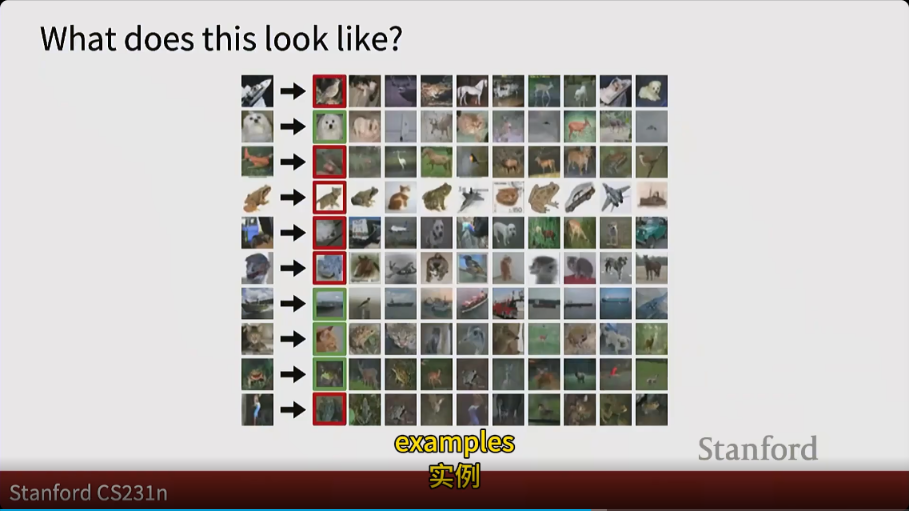
[00:43:35](https://www.bilibili.com/video/BV1YJ3PzLEiW/?p=2&spm_id_from=333.1007.top_right_bar_window_history.content.click&vd_source=2c95328d728d9b9a500883028f75d2f3)

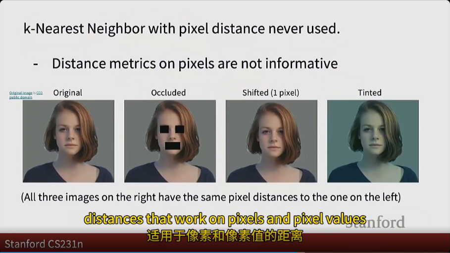
[00:44:12](https://www.bilibili.com/video/BV1YJ3PzLEiW/?p=2&spm_id_from=333.1007.top_right_bar_window_history.content.click&vd_source=2c95328d728d9b9a500883028f75d2f3)


[00:46:02](https://www.bilibili.com/video/BV1YJ3PzLEiW/?p=2&spm_id_from=333.1007.top_right_bar_window_history.content.click&vd_source=2c95328d728d9b9a500883028f75d2f3)

**结论**：KNN在CIFAR-10上表现一般，因为像素距离不能很好地捕捉语义相似性。

---


## 6. 线性分类器

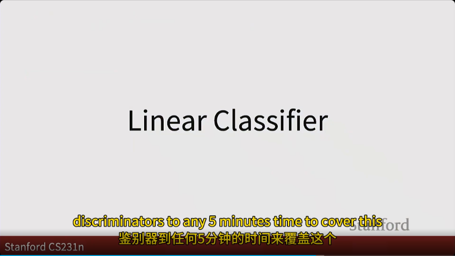
[00:46:33](https://www.bilibili.com/video/BV1YJ3PzLEiW/?p=2&spm_id_from=333.1007.top_right_bar_window_history.content.click&vd_source=2c95328d728d9b9a500883028f75d2f3)


### 6.1 参数化方法

与KNN不同，线性分类器是一种**参数化方法**：

**KNN（非参数）**：

- 训练：存储所有数据
- 预测：遍历所有数据

**线性分类器（参数化）**：

- 训练：学习参数W和b
- 预测：快速计算 $f(x, W, b)$

### 6.2 数学表示

线性分类器定义为：

$$f(x, W, b) = Wx + b$$

**符号说明**：

- $x$：输入图像（拉直成向量）
- $W$：权重矩阵
- $b$：偏置向量
- $f(x, W, b)$：输出分数（每个类别的得分）

**维度分析**（以CIFAR-10为例）：

```
输入图像：32 × 32 × 3 = 3,072 维
输出类别：10 类

x: [3,072 × 1] 列向量
W: [10 × 3,072] 权重矩阵
b: [10 × 1] 偏置向量

输出 = Wx + b: [10 × 1] 分数向量
```

**计算示例**：

```python
import numpy as np

# 输入图像（拉直）
x = np.random.randn(3072, 1)  # 32x32x3 = 3072

# 权重和偏置
W = np.random.randn(10, 3072)  # 10个类别
b = np.random.randn(10, 1)

# 计算分数
scores = W.dot(x) + b  # [10, 1]
```

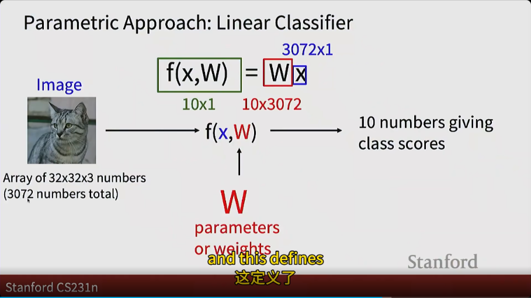
[00:48:14](https://www.bilibili.com/video/BV1YJ3PzLEiW/?p=2&spm_id_from=333.1007.top_right_bar_window_history.content.click&vd_source=2c95328d728d9b9a500883028f75d2f3)

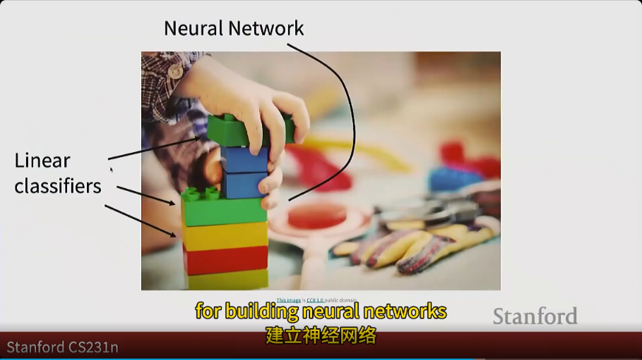
[00:49:26](https://www.bilibili.com/video/BV1YJ3PzLEiW/?p=2&spm_id_from=333.1007.top_right_bar_window_history.content.click&vd_source=2c95328d728d9b9a500883028f75d2f3)

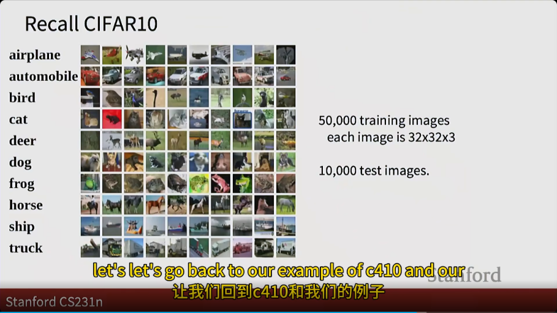
[00:50:09](https://www.bilibili.com/video/BV1YJ3PzLEiW/?p=2&spm_id_from=333.1007.top_right_bar_window_history.content.click&vd_source=2c95328d728d9b9a500883028f75d2f3)


[00:50:25](https://www.bilibili.com/video/BV1YJ3PzLEiW/?p=2&spm_id_from=333.1007.top_right_bar_window_history.content.click&vd_source=2c95328d728d9b9a500883028f75d2f3)

### 6.3 偏置项的作用

**无偏置**：$f(x, W) = Wx$

- 所有分类超平面必须过原点

**有偏置**：$f(x, W, b) = Wx + b$

- 允许超平面平移
- 提供更大的灵活性
- 对类别不平衡有帮助

**示例**：假设某个类别的样本都偏向正值，偏置可以调整该类别的基准分数。

### 6.4 线性分类器的三种解释

#### 6.4.1 代数解释

线性分类器是一个简单的函数：

$$\begin{bmatrix} s_1 \\ s_2 \\ \vdots \\ s_{10} \end{bmatrix} = \begin{bmatrix} w_1^T \\ w_2^T \\ \vdots \\ w_{10}^T \end{bmatrix} \begin{bmatrix} x_1 \\ x_2 \\ \vdots \\ x_{3072} \end{bmatrix} + \begin{bmatrix} b_1 \\ b_2 \\ \vdots \\ b_{10} \end{bmatrix}$$

每个类别 $c$ 的分数为：
$$s_c = w_c^T x + b_c = \sum_{i=1}^{3072} w_{c,i} x_i + b_c$$

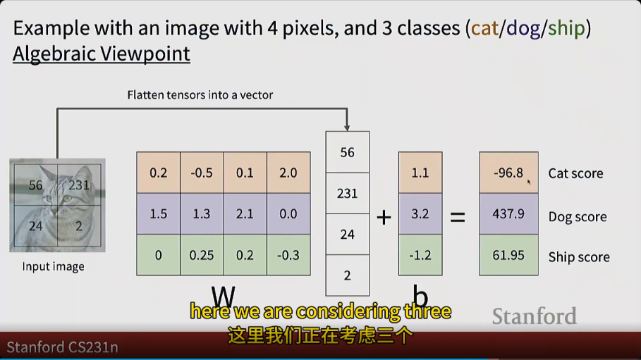
[00:50:59](https://www.bilibili.com/video/BV1YJ3PzLEiW/?p=2&spm_id_from=333.1007.top_right_bar_window_history.content.click&vd_source=2c95328d728d9b9a500883028f75d2f3)

#### 6.4.2 视觉解释

**权重矩阵W的每一行是一个类别的模板**：

```
W的第1行 = cat模板（3,072个数字）
W的第2行 = dog模板（3,072个数字）
...
W的第10行 = truck模板（3,072个数字）
```

**预测过程**：

1. 将输入图像与每个模板做内积
2. 内积值表示相似度
3. 选择分数最高的类别

**CIFAR-10学到的模板可视化**：

- Car模板：可能显示汽车的轮廓
- Airplane模板：可能显示飞机的形状
- 每个类别只学习一个模板（这是线性分类器的局限）

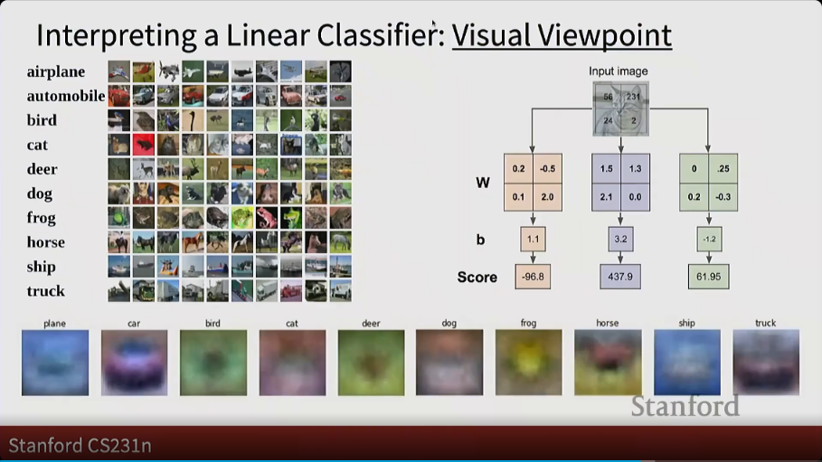
[00:52:14](https://www.bilibili.com/video/BV1YJ3PzLEiW/?p=2&spm_id_from=333.1007.top_right_bar_window_history.content.click&vd_source=2c95328d728d9b9a500883028f75d2f3)

#### 6.4.3 几何解释

在高维空间中，线性分类器定义了**分类超平面**：

**2D情况**（2个特征）：

- 分类边界是直线
- 方程：$w_1x_1 + w_2x_2 + b = 0$

**3D情况**（3个特征）：

- 分类边界是平面

**高维情况**（3,072个特征）：

- 分类边界是超平面

**多类别情况**：

- K个类别需要K个超平面
- 空间被划分为K个区域

**偏置的几何意义**：

- 控制超平面到原点的距离
- 允许超平面不经过原点

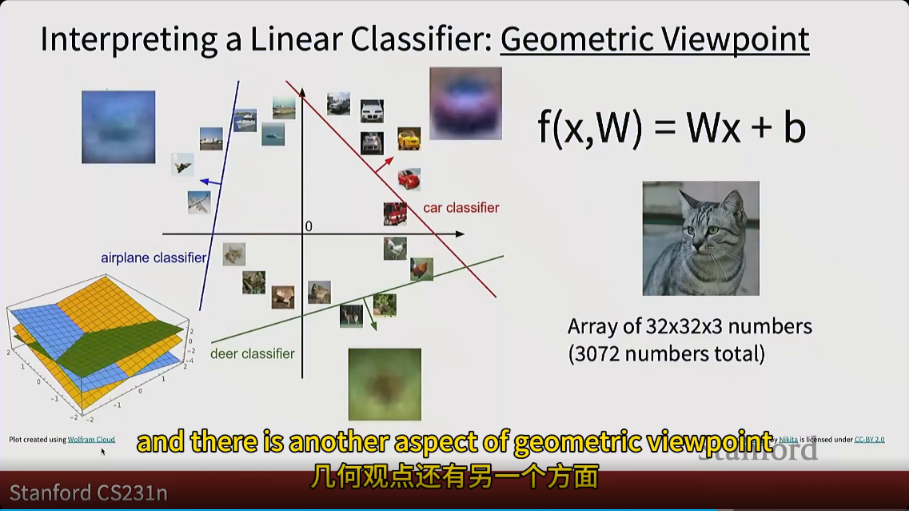
[00:52:52](https://www.bilibili.com/video/BV1YJ3PzLEiW/?p=2&spm_id_from=333.1007.top_right_bar_window_history.content.click&vd_source=2c95328d728d9b9a500883028f75d2f3)

### 6.5 线性分类器的局限性

线性分类器无法解决以下问题：

**问题1：XOR问题**

```
类别1：象限1和象限3
类别2：象限2和象限4
```

无法用一条直线分开。

**问题2：同心圆问题**

```
类别1：距原点距离在[1, 2]之间的点
类别2：其他点
```

需要非线性边界。

**问题3：多模态问题**

```
类别1：三个分离的区域
类别2：三个区域之间的空间
```

单个线性分类器只能学习一个模板，无法捕捉类内的多样性。

**解决方案**（后续课程）：

- 使用非线性激活函数
- 堆叠多个线性层形成神经网络
- 使用特征变换

---

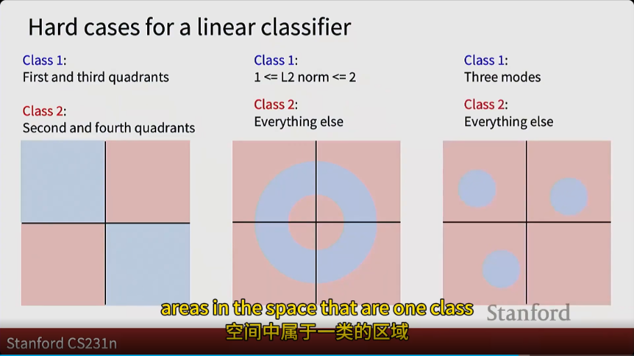
[00:54:49](https://www.bilibili.com/video/BV1YJ3PzLEiW/?p=2&spm_id_from=333.1007.top_right_bar_window_history.content.click&vd_source=2c95328d728d9b9a500883028f75d2f3)

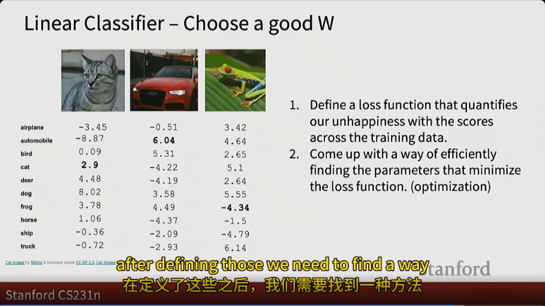
[00:55:51](https://www.bilibili.com/video/BV1YJ3PzLEiW/?p=2&spm_id_from=333.1007.top_right_bar_window_history.content.click&vd_source=2c95328d728d9b9a500883028f75d2f3)

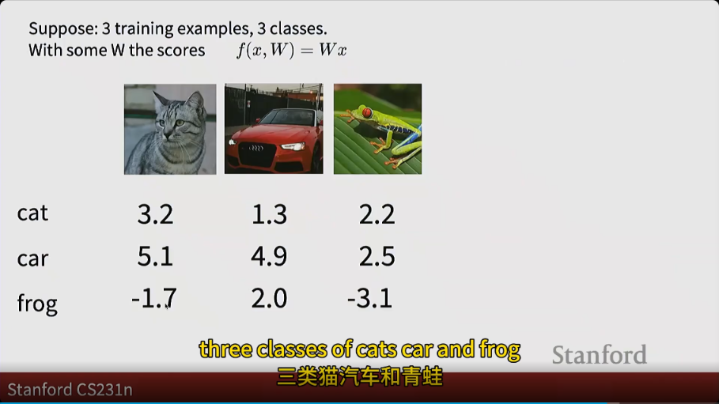
[00:56:34](https://www.bilibili.com/video/BV1YJ3PzLEiW/?p=2&spm_id_from=333.1007.top_right_bar_window_history.content.click&vd_source=2c95328d728d9b9a500883028f75d2f3)

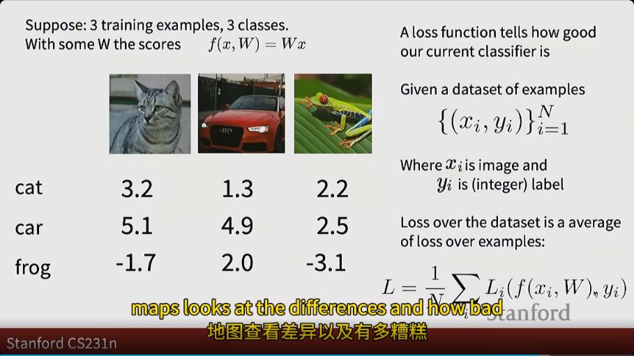
[00:56:59](https://www.bilibili.com/video/BV1YJ3PzLEiW/?p=2&spm_id_from=333.1007.top_right_bar_window_history.content.click&vd_source=2c95328d728d9b9a500883028f75d2f3)

## 7. Softmax分类器与损失函数

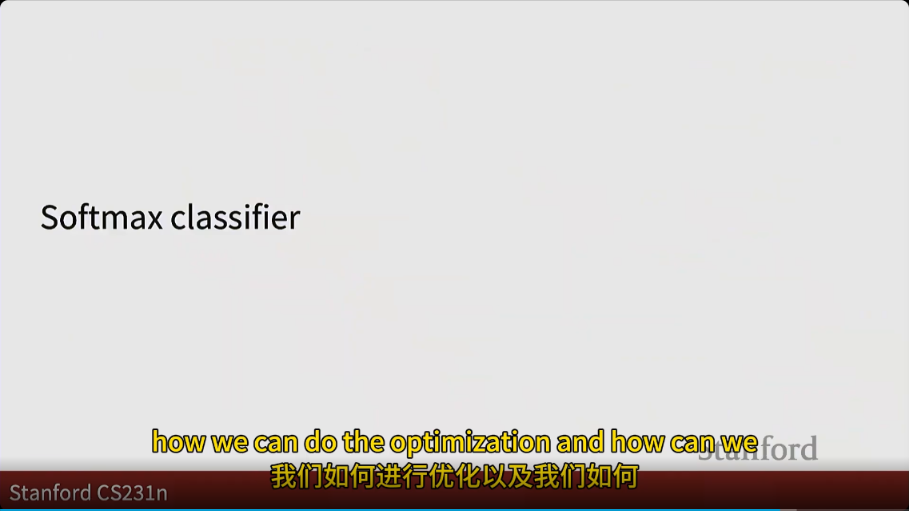
[00:57:31](https://www.bilibili.com/video/BV1YJ3PzLEiW/?p=2&spm_id_from=333.1007.top_right_bar_window_history.content.click&vd_source=2c95328d728d9b9a500883028f75d2f3)

### 7.1 损失函数的需求

已知线性函数 $f(x, W) = Wx + b$ 能计算分数，现在需要：

**问题1**：如何评估当前参数W的好坏？
**答案**：定义损失函数（Loss Function）

**问题2**：如何找到最优的W？
**答案**：优化算法（下节课内容）

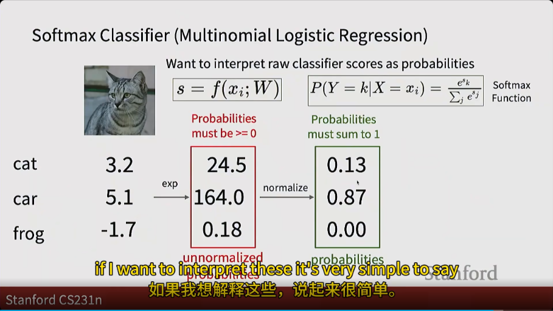
[00:59:49](https://www.bilibili.com/video/BV1YJ3PzLEiW/?p=2&spm_id_from=333.1007.top_right_bar_window_history.content.click&vd_source=2c95328d728d9b9a500883028f75d2f3)

### 7.2 损失函数定义

**数学表示**：

$$L = \frac{1}{N} \sum_{i=1}^{N} L_i(f(x_i, W), y_i)$$

其中：

- $N$：训练样本数量
- $L_i$：第i个样本的损失
- $f(x_i, W)$：模型对第i个样本的预测分数
- $y_i$：第i个样本的真实标签

**直观理解**：

- 损失函数量化模型的"不开心程度"
- 损失越小，模型越好
- 目标：最小化损失

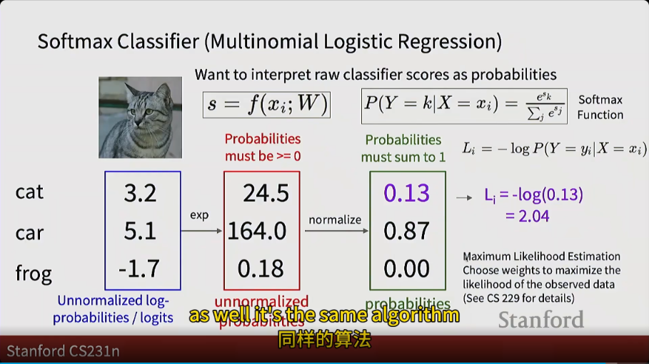
[01:02:33](https://www.bilibili.com/video/BV1YJ3PzLEiW/?p=2&spm_id_from=333.1007.top_right_bar_window_history.content.click&vd_source=2c95328d728d9b9a500883028f75d2f3)

### 7.3 Softmax分类器

#### 7.3.1 从分数到概率

线性函数输出的是**未归一化的分数（logits）**：

$$s = f(x, W) = [s_1, s_2, \ldots, s_K]$$

**问题**：分数没有概率意义（可以是负数，可以很大）

**解决**：使用Softmax函数转换为概率分布：

$$P(Y=k|X=x_i) = \frac{e^{s_k}}{\sum_{j=1}^{K} e^{s_j}}$$

**Softmax的特性**：

1. **非负性**：$e^{s_k} > 0$
2. **归一化**：$\sum_{k=1}^{K} P(Y=k|X=x_i) = 1$
3. **单调性**：分数越高，概率越大
4. **可微性**：便于梯度下降优化

#### 7.3.2 数值示例

假设某个样本的分数为：

```
s = [3.2, 5.1, -1.7]  # cat, car, frog
真实标签：cat (索引0)
```

**步骤1：指数化**

```
exp(s) = [e^3.2, e^5.1, e^-1.7]
       = [24.5, 164.0, 0.18]
```

**步骤2：归一化**

```
sum = 24.5 + 164.0 + 0.18 = 188.68

P(cat) = 24.5 / 188.68 = 0.13
P(car) = 164.0 / 188.68 = 0.87
P(frog) = 0.18 / 188.68 = 0.001
```

**解释**：模型认为这张图像是cat的概率为13%（错误的预测！）


[01:03:28](https://www.bilibili.com/video/BV1YJ3PzLEiW/?p=2&spm_id_from=333.1007.top_right_bar_window_history.content.click&vd_source=2c95328d728d9b9a500883028f75d2f3)

### 7.4 交叉熵损失

#### 7.4.1 定义

对于单个样本，Softmax损失定义为：

$$L_i = -\log P(Y=y_i|X=x_i) = -\log \left( \frac{e^{s_{y_i}}}{\sum_j e^{s_j}} \right)$$

**简化**：
$$L_i = -s_{y_i} + \log \sum_j e^{s_j}$$

#### 7.4.2 直觉理解

**目标**：最大化正确类别的概率
$$\max P(Y=y_i|X=x_i)$$

**等价于**：最小化负对数概率
$$\min -\log P(Y=y_i|X=x_i)$$

**为什么用对数？**

1. 将乘法转换为加法（数值稳定）
2. 将概率（0-1）映射到损失（0-∞）
3. 惩罚错误预测更严重

#### 7.4.3 损失范围

**理论范围**：

- 最小值：0（当 $P(Y=y_i|X=x_i) = 1$ 时）
- 最大值：$\infty$（当 $P(Y=y_i|X=x_i) \to 0$ 时）

**初始化检查**：
在随机初始化时，所有类别概率应该接近相等：

$$P(Y=k|X=x_i) \approx \frac{1}{C}$$

因此初始损失应该约为：

$$L_i \approx -\log\left(\frac{1}{C}\right) = \log(C)$$

**CIFAR-10示例**（C=10）：
$$L_i \approx \log(10) = 2.3$$

**调试技巧**：如果初始损失不是 $\log(C)$，说明实现有bug！

### 7.5 交叉熵的信息论解释

#### 7.5.1 与KL散度的关系

**真实分布** $p$（one-hot编码）：
$$p = [0, 0, \ldots, 1, \ldots, 0]$$
（只有正确类别为1，其他为0）

**预测分布** $q$（Softmax输出）：
$$q = [P(Y=1), P(Y=2), \ldots, P(Y=K)]$$

**KL散度**：
$$D_{KL}(p \| q) = \sum_k p_k \log \frac{p_k}{q_k}$$

当 $p$ 是one-hot时：
$$D_{KL}(p \| q) = -\log q_{y_i}$$

这正是Softmax损失！

#### 7.5.2 与熵的关系

**交叉熵**：
$$H(p, q) = -\sum_k p_k \log q_k$$

**关系**：
$$H(p, q) = H(p) + D_{KL}(p \| q)$$

对于one-hot编码的 $p$：

- $H(p) = 0$（完全确定）
- 因此 $H(p, q) = D_{KL}(p \| q)$

**命名由来**：这就是为什么Softmax损失也称为**交叉熵损失**。

### 7.6 实现细节

#### 数值稳定性

直接计算 $e^{s_k}$ 可能导致数值溢出。

**改进**：
$$\frac{e^{s_k}}{\sum_j e^{s_j}} = \frac{Ce^{s_k}}{C\sum_j e^{s_j}} = \frac{e^{s_k + \log C}}{\sum_j e^{s_j + \log C}}$$

选择 $C = e^{-\max_j s_j}$：

```python
def softmax_stable(scores):
    """
    数值稳定的Softmax实现
    """
    # 减去最大值防止溢出
    scores_shifted = scores - np.max(scores)
    exp_scores = np.exp(scores_shifted)
    probs = exp_scores / np.sum(exp_scores)
    return probs

def cross_entropy_loss(scores, y):
    """
    交叉熵损失
    """
    probs = softmax_stable(scores)
    loss = -np.log(probs[y])
    return loss
```

---

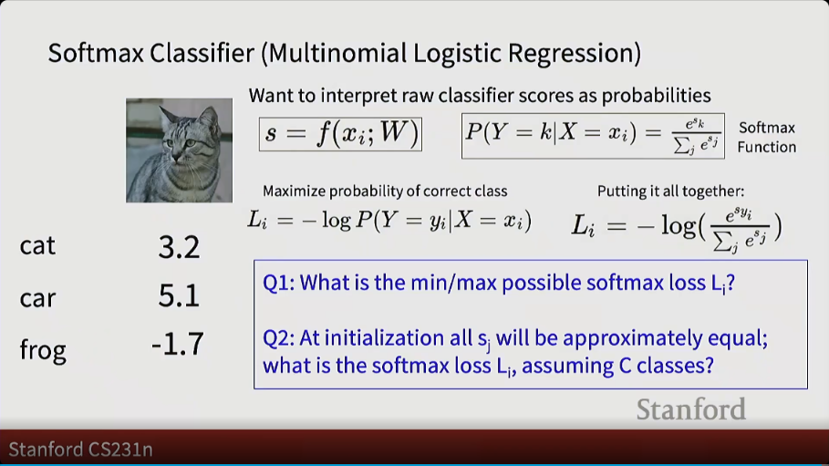
[01:06:26](https://www.bilibili.com/video/BV1YJ3PzLEiW/?p=2&spm_id_from=333.1007.top_right_bar_window_history.content.click&vd_source=2c95328d728d9b9a500883028f75d2f3)

## 核心要点总结

### 关键概念

1. **图像分类的挑战**
   - 语义鸿沟：人类感知 vs 计算机表示
   - 视角、光照、遮挡、形变等变化

2. **数据驱动方法**
   - 收集数据 → 训练模型 → 评估预测
   - 替代手工设计规则

3. **K近邻算法**
   - 简单但效率低（训练O(1)，预测O(N)）
   - 距离度量：L1（曼哈顿）vs L2（欧氏）
   - 实际应用中效果有限（基于像素距离）

4. **超参数调优**
   - 使用验证集，不要用测试集
   - 交叉验证提供更可靠的结果
   - 在深度学习中常用单个验证集

5. **线性分类器**
   - 参数化方法：$f(x, W) = Wx + b$
   - 三种解释：代数（加权和）、视觉（模板匹配）、几何（超平面）
   - 局限性：无法解决非线性可分问题

6. **Softmax分类器**
   - 将分数转换为概率：Softmax函数
   - 损失函数：交叉熵（负对数似然）
   - 初始化检查：损失应约为 $\log(C)$

### 重要公式

| 概念       | 公式                                                 |
| ---------- | ---------------------------------------------------- |
| L1距离     | $d_{L1}(I_1, I_2) = \sum_p \|I_1^p - I_2^p\|$        |
| L2距离     | $d_{L2}(I_1, I_2) = \sqrt{\sum_p (I_1^p - I_2^p)^2}$ |
| 线性分类器 | $f(x, W, b) = Wx + b$                                |
| Softmax    | $P(Y=k\|X) = \frac{e^{s_k}}{\sum_j e^{s_j}}$         |
| 交叉熵损失 | $L = -\log P(Y=y_i\|X=x_i)$                          |
| 总损失     | $L = \frac{1}{N} \sum_{i=1}^N L_i$                   |

### 下节预告

- **优化算法**：如何找到最优的W？
- **梯度下降**：迭代更新参数
- **反向传播**：高效计算梯度
- **神经网络**：堆叠多个线性层

---

## 参考资料

### 数据集

- **CIFAR-10**: [https://www.cs.toronto.edu/~kriz/cifar.html](https://www.cs.toronto.edu/~kriz/cifar.html)
- **ImageNet**: [https://www.image-net.org/](https://www.image-net.org/)

